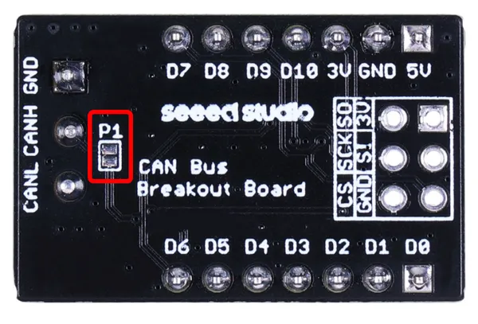
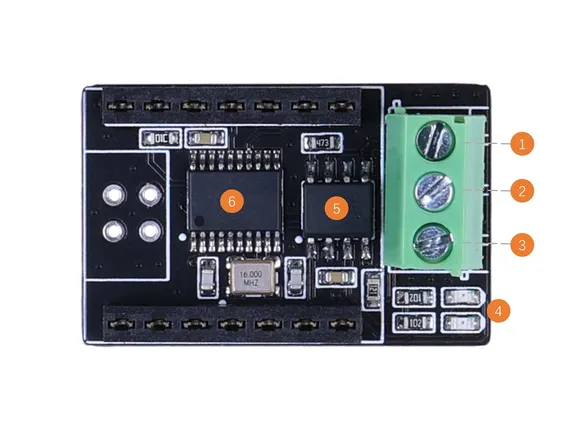

# XIAO CAN Bus Expansion Board

**Seeed Studio** · Source collection

Revision: Unverified source identity  
Coverage: Source collection; review pending

[Browse all manufacturers](../../../../BROWSE.md) · [Desktop app](https://github.com/valleytechsolutions/black-wire-desktop)

## Hardware Overview (Back)

**source reference** · Unreviewed source · PNG

[Open original reference](../../../../library/media/7355f8645cc7b96c9eefc3207f313238af4aa183ae3c10826dd7b67629b601e5.png)

**Credit and rights:** Source rights not yet established. Source/manufacturer: Seeed Studio.

[Source 1](https://files.seeedstudio.com/wiki/xiao_can_bus_board/3.png) · [Source 2](https://wiki.seeedstudio.com/xiao-can-bus-expansion/)

Original source index: Hardware Overview (Back). This file is searchable but has not been promoted to a reviewed physical board pinout.

SHA-256: `7355f8645cc7b96c9eefc3207f313238af4aa183ae3c10826dd7b67629b601e5`

## Hardware Overview (Front)

**source reference** · Unreviewed source · JPG

[Open original reference](../../../../library/media/a92bae339ddd338b763670b019000dff3e3f41f6d01bf6fb121e1fa1c0abe1d2.jpg)

**Credit and rights:** Source rights not yet established. Source/manufacturer: Seeed Studio.

[Source 1](https://files.seeedstudio.com/wiki/xiao_can_bus_board/hw.jpg) · [Source 2](https://wiki.seeedstudio.com/xiao-can-bus-expansion/)

Original source index: Hardware Overview (Front). This file is searchable but has not been promoted to a reviewed physical board pinout.

SHA-256: `a92bae339ddd338b763670b019000dff3e3f41f6d01bf6fb121e1fa1c0abe1d2`

Pin assignments have not been independently electrically verified. Check board revision before wiring.
