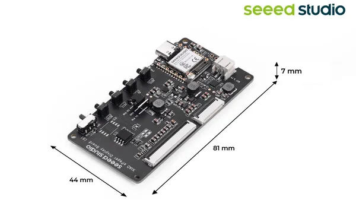
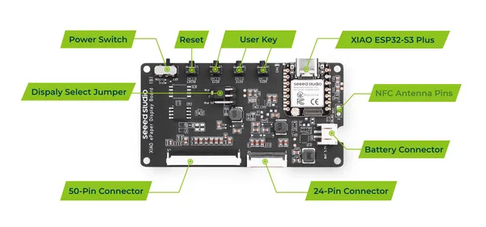

# XIAO ePaper Display Board EE04

**Seeed Studio** · Source collection

Revision: Unverified source identity  
Coverage: Source collection; review pending

[Browse all manufacturers](../../../../BROWSE.md) · [Desktop app](https://github.com/valleytechsolutions/black-wire-desktop)

## Dimensions

**source reference** · Unreviewed source · JPG

[Open original reference](../../../../library/media/8506ee303059b647ca33cf19f16162c60a157ef2ac61aaf12c027046a72282fd.jpg)

**Credit and rights:** Source rights not yet established. Source/manufacturer: Seeed Studio.

[Source 1](https://files.seeedstudio.com/wiki/Epaper/EE04/EE04_1.jpg) · [Source 2](https://wiki.seeedstudio.com/epaper_ee04/)

Original source index: Dimensions. This file is searchable but has not been promoted to a reviewed physical board pinout.

SHA-256: `8506ee303059b647ca33cf19f16162c60a157ef2ac61aaf12c027046a72282fd`

## Hardware Overview

**source reference** · Unreviewed source · PNG

[Open original reference](../../../../library/media/e18108778032fc6b86d9d93b006c7fb8abdc80da79293100bf132389a4b04391.png)

**Credit and rights:** Source rights not yet established. Source/manufacturer: Seeed Studio.

[Source 1](https://files.seeedstudio.com/wiki/Epaper/EE04/hardwareoview.png) · [Source 2](https://wiki.seeedstudio.com/epaper_ee04/)

Original source index: Hardware Overview. This file is searchable but has not been promoted to a reviewed physical board pinout.

SHA-256: `e18108778032fc6b86d9d93b006c7fb8abdc80da79293100bf132389a4b04391`

Pin assignments have not been independently electrically verified. Check board revision before wiring.
