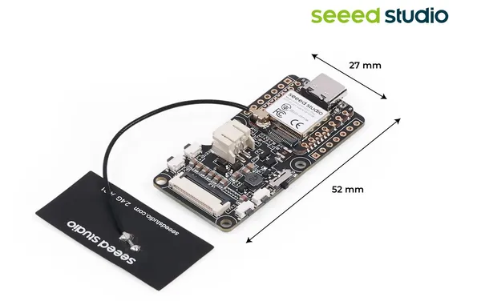
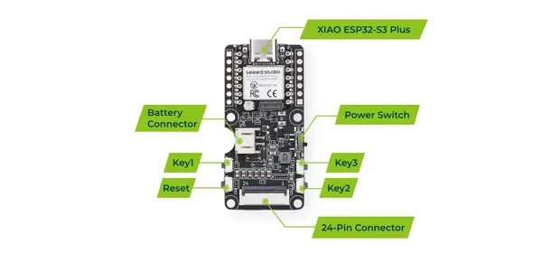

# XIAO ePaper Display Board EE05

**Seeed Studio** · Source collection

Revision: Unverified source identity  
Coverage: Source collection; review pending

[Browse all manufacturers](../../../../BROWSE.md) · [Desktop app](https://github.com/valleytechsolutions/black-wire-desktop)

## Dimensions

**source reference** · Unreviewed source · JPG

[Open original reference](../../../../library/media/9c6329428863f02af983d115052be345cf9d41972bb1d692aa27bde1cd2818f7.jpg)

**Credit and rights:** Source rights not yet established. Source/manufacturer: Seeed Studio.

[Source 1](https://files.seeedstudio.com/wiki/Epaper/EE05/4.jpg) · [Source 2](https://wiki.seeedstudio.com/epaper_ee05/)

Original source index: Dimensions. This file is searchable but has not been promoted to a reviewed physical board pinout.

SHA-256: `9c6329428863f02af983d115052be345cf9d41972bb1d692aa27bde1cd2818f7`

## Hardware Overview

**source reference** · Unreviewed source · PNG

[Open original reference](../../../../library/media/69f9075ab4d852ca72a6a7b477c76e534a4ccef975b7e02f169c65cc0ca8830b.png)

**Credit and rights:** Source rights not yet established. Source/manufacturer: Seeed Studio.

[Source 1](https://files.seeedstudio.com/wiki/Epaper/EE05/EE05_Pin.png) · [Source 2](https://wiki.seeedstudio.com/epaper_ee05/)

Original source index: Hardware Overview. This file is searchable but has not been promoted to a reviewed physical board pinout.

SHA-256: `69f9075ab4d852ca72a6a7b477c76e534a4ccef975b7e02f169c65cc0ca8830b`

Pin assignments have not been independently electrically verified. Check board revision before wiring.
