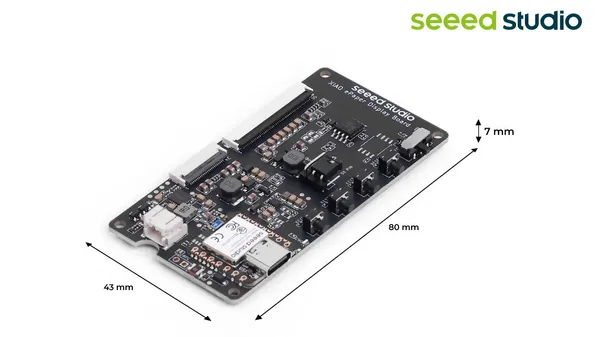
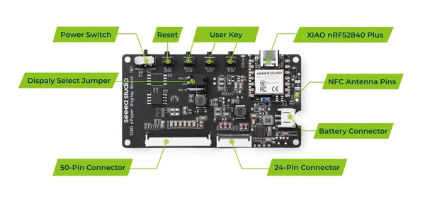

# XIAO ePaper Display Board EN04

**Seeed Studio** · Source collection

Revision: Unverified source identity  
Coverage: Source collection; review pending

[Browse all manufacturers](../../../../BROWSE.md) · [Desktop app](https://github.com/valleytechsolutions/black-wire-desktop)

## Dimensions

**source reference** · Unreviewed source · JPG

[Open original reference](../../../../library/media/1e97fe00653c9b4bb33e068d3442efbabab7c7dbd93e71553d82bd69a62f3116.jpg)

**Credit and rights:** Source rights not yet established. Source/manufacturer: Seeed Studio.

[Source 1](https://files.seeedstudio.com/wiki/Epaper/EN04/EN04_1.jpg) · [Source 2](https://wiki.seeedstudio.com/xiao_epaper_display_board_overview/)

Original source index: Dimensions. This file is searchable but has not been promoted to a reviewed physical board pinout.

SHA-256: `1e97fe00653c9b4bb33e068d3442efbabab7c7dbd93e71553d82bd69a62f3116`

## Hardware Overview

**source reference** · Unreviewed source · PNG

[Open original reference](../../../../library/media/c083587ccb9713fa9f59cf33ca30ae34b55bd8a188046701dafcbaa04cc4f640.png)

**Credit and rights:** Source rights not yet established. Source/manufacturer: Seeed Studio.

[Source 1](https://files.seeedstudio.com/wiki/Epaper/EN04/hardwareoview.png) · [Source 2](https://wiki.seeedstudio.com/epaper_EN04/)

Original source index: Hardware Overview. This file is searchable but has not been promoted to a reviewed physical board pinout.

SHA-256: `c083587ccb9713fa9f59cf33ca30ae34b55bd8a188046701dafcbaa04cc4f640`

Pin assignments have not been independently electrically verified. Check board revision before wiring.
