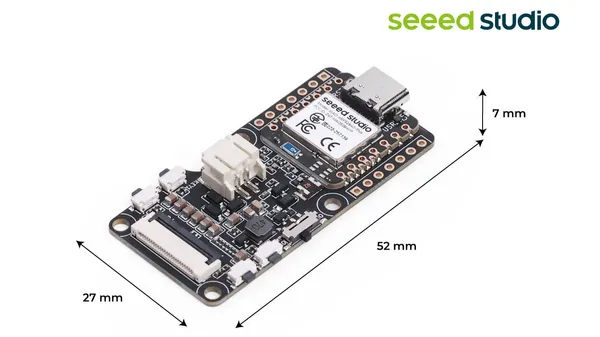

# XIAO ePaper Display Board EN05

**Seeed Studio** · Source collection

Revision: Unverified source identity  
Coverage: Source collection; review pending

[Browse all manufacturers](../../../../BROWSE.md) · [Desktop app](https://github.com/valleytechsolutions/black-wire-desktop)

## Dimensions

**source reference** · Unreviewed source · JPG

[Open original reference](../../../../library/media/7f16193bb2811584e0a17e252e6bbe00769be6e97436a7d513fbfad84750e75b.jpg)

**Credit and rights:** Source rights not yet established. Source/manufacturer: Seeed Studio.

[Source 1](https://files.seeedstudio.com/wiki/Epaper/EN05/3.jpg) · [Source 2](https://wiki.seeedstudio.com/xiao_epaper_display_board_overview/)

Original source index: Dimensions. This file is searchable but has not been promoted to a reviewed physical board pinout.

SHA-256: `7f16193bb2811584e0a17e252e6bbe00769be6e97436a7d513fbfad84750e75b`

Pin assignments have not been independently electrically verified. Check board revision before wiring.
