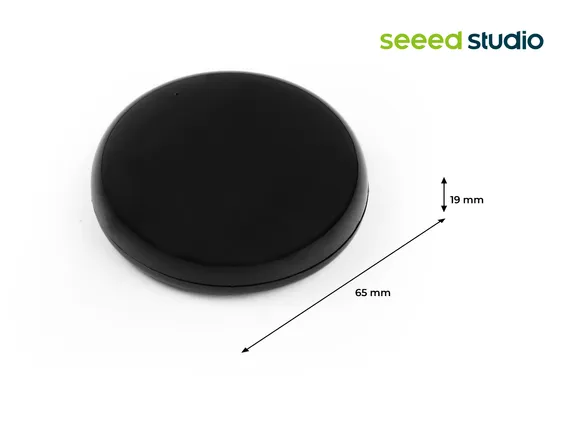

# XIAO IR Mate Smart IR Remote

**Seeed Studio** · Source collection

Revision: Unverified source identity  
Coverage: Source collection; review pending

[Browse all manufacturers](../../../../BROWSE.md) · [Desktop app](https://github.com/valleytechsolutions/black-wire-desktop)

## Dimensions

**source reference** · Unreviewed source · JPG

[Open original reference](../../../../library/media/90951df18682a41b17ee6fef4ac2f1511240459c3f6d3b09e7af6697614964a0.jpg)

**Credit and rights:** Source rights not yet established. Source/manufacturer: Seeed Studio.

[Source 1](https://files.seeedstudio.com/wiki/XIAO_IR_MATE/6-109990586-XIAO-Smart-IR-Mate.jpg) · [Source 2](https://wiki.seeedstudio.com/XIAO_IR_Mate_Smart_IR_Remote/)

Original source index: Dimensions. This file is searchable but has not been promoted to a reviewed physical board pinout.

SHA-256: `90951df18682a41b17ee6fef4ac2f1511240459c3f6d3b09e7af6697614964a0`

Pin assignments have not been independently electrically verified. Check board revision before wiring.
