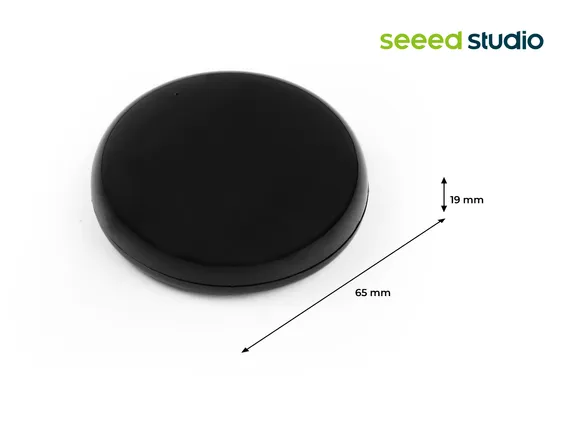

# XIAO IR Mate Smart IR Remote

**Seeed Studio** · Source collection

Revision: Unverified source identity

Coverage: Source collection; review pending

[Browse all manufacturers](../../../../BROWSE.md) · [Devices & IoT](../../../../DEVICES.md) · [Open in the browser guide](https://valleytech-black-wire-guide.pages.dev/?board=source-board-4c7a32b6f6919ca9aa)

## Datasheets and original documentation

Board datasheet: **not yet recorded**. Visual reference: **available**.

[Manufacturer source (recorded link)](https://wiki.seeedstudio.com/XIAO_IR_Mate_Smart_IR_Remote/)

A chip datasheet, schematic and board datasheet have different scopes. Match the exact hardware revision.

[Documentation coverage and remaining gaps](../../../../DOCUMENTATION.md)

## Dimensions

**source reference** · Unreviewed source · JPG

[Open original reference](../../../../library/media/90951df18682a41b17ee6fef4ac2f1511240459c3f6d3b09e7af6697614964a0.jpg)

**Credit and rights:** Source rights not yet established. Source/manufacturer: Seeed Studio.

[Source 1](https://files.seeedstudio.com/wiki/XIAO_IR_MATE/6-109990586-XIAO-Smart-IR-Mate.jpg) · [Source 2](https://wiki.seeedstudio.com/XIAO_IR_Mate_Smart_IR_Remote/)

Original source index: Dimensions. This file is searchable but has not been promoted to a reviewed physical board pinout.

Image revision: Not identified

SHA-256: `90951df18682a41b17ee6fef4ac2f1511240459c3f6d3b09e7af6697614964a0`

Pin assignments have not been independently electrically verified. Check board revision before wiring.
