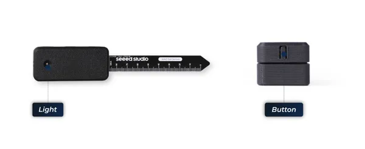

# XIAO Soil Moisture Sensor

**Seeed Studio** · Source collection

Revision: Unverified source identity

Coverage: Source collection; review pending

[Browse all manufacturers](../../../../BROWSE.md) · [Devices & IoT](../../../../DEVICES.md) · [Open in the browser guide](https://valleytech-black-wire-guide.pages.dev/?board=source-board-86ebac141812f19aab)

## Datasheets and original documentation

Board datasheet: **not yet recorded**. Visual reference: **available**.

[Manufacturer source (recorded link)](https://wiki.seeedstudio.com/xiao_soil_moisture_sensor/)

A chip datasheet, schematic and board datasheet have different scopes. Match the exact hardware revision.

[Documentation coverage and remaining gaps](../../../../DOCUMENTATION.md)

## Hardware Overview

**source reference** · Unreviewed source · JPG

[Open original reference](../../../../library/media/70ec2fdd3b9b6da71d3bf5179d3f361b62e02ebd8082c8c34891d361053c7a40.jpg)

**Credit and rights:** Source rights not yet established. Source/manufacturer: Seeed Studio.

[Source 1](https://files.seeedstudio.com/wiki/XIAO_Soil_Moisture_Sensor/img/hardware.jpg) · [Source 2](https://wiki.seeedstudio.com/xiao_soil_moisture_sensor/)

Original source index: Hardware Overview. This file is searchable but has not been promoted to a reviewed physical board pinout.

Image revision: Not identified

SHA-256: `70ec2fdd3b9b6da71d3bf5179d3f361b62e02ebd8082c8c34891d361053c7a40`

Pin assignments have not been independently electrically verified. Check board revision before wiring.
