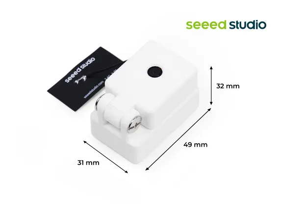

# XIAO Vision AI Camera

**Seeed Studio** · Source collection

Revision: Unverified source identity  
Coverage: Source collection; review pending

[Browse all manufacturers](../../../../BROWSE.md) · [Desktop app](https://github.com/valleytechsolutions/black-wire-desktop)

## Dimensions

**source reference** · Unreviewed source · JPG

[Open original reference](../../../../library/media/e66e971c46aec8623e592ec90281e0e86b85b926a58602d677dc29737ed2e948.jpg)

**Credit and rights:** Source rights not yet established. Source/manufacturer: Seeed Studio.

[Source 1](https://media-cdn.seeedstudio.com/media/catalog/product/9/-/9-104990982-xiao-vision-ai-camera.jpg) · [Source 2](https://www.seeedstudio.com/XIAO-Vision-AI-Camera-p-6450.html)

Original source index: Dimensions. This file is searchable but has not been promoted to a reviewed physical board pinout.

SHA-256: `e66e971c46aec8623e592ec90281e0e86b85b926a58602d677dc29737ed2e948`

Pin assignments have not been independently electrically verified. Check board revision before wiring.
