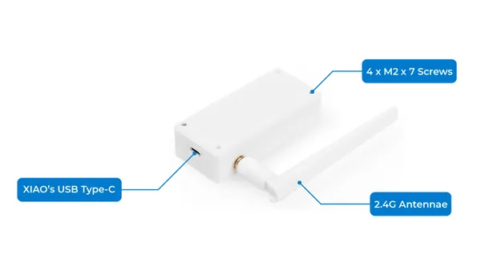
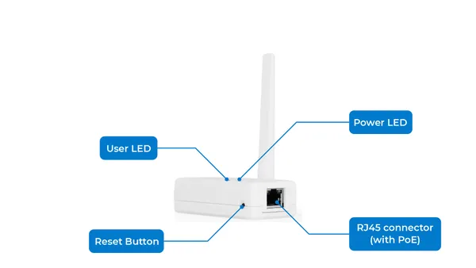
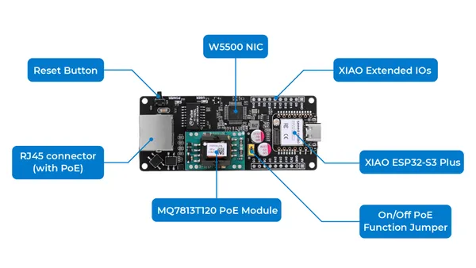

# XIAO W5500 Ethernet Adapter

**Seeed Studio** · Source collection

Revision: Unverified source identity  
Coverage: Source collection; review pending

[Browse all manufacturers](../../../../BROWSE.md) · [Desktop app](https://github.com/valleytechsolutions/black-wire-desktop)

## Hardware Overview (Back)

**source reference** · Unreviewed source · JPG

[Open original reference](../../../../library/media/575ce48c8b064a079f368aee607b7c54bd3d4f0990a998c67fbe7e8be89dae83.jpg)

**Credit and rights:** Source rights not yet established. Source/manufacturer: Seeed Studio.

[Source 1](https://files.seeedstudio.com/wiki/xiao_w5500_poe/2.jpg) · [Source 2](https://wiki.seeedstudio.com/xiao_w5500_ethernet_adapter/)

Original source index: Hardware Overview (Back). This file is searchable but has not been promoted to a reviewed physical board pinout.

SHA-256: `575ce48c8b064a079f368aee607b7c54bd3d4f0990a998c67fbe7e8be89dae83`

## Hardware Overview (Front)

**source reference** · Unreviewed source · JPG

[Open original reference](../../../../library/media/001d8f9977f4e784b39e409465e4c8ec4d9f9a2da9699ca2bc85d460d592403e.jpg)

**Credit and rights:** Source rights not yet established. Source/manufacturer: Seeed Studio.

[Source 1](https://files.seeedstudio.com/wiki/xiao_w5500_poe/3.jpg) · [Source 2](https://wiki.seeedstudio.com/xiao_w5500_ethernet_adapter/)

Original source index: Hardware Overview (Front). This file is searchable but has not been promoted to a reviewed physical board pinout.

SHA-256: `001d8f9977f4e784b39e409465e4c8ec4d9f9a2da9699ca2bc85d460d592403e`

## Hardware Overview (Inside)

**source reference** · Unreviewed source · JPG

[Open original reference](../../../../library/media/b8d6910013e85ce3a1c69e1d5adcd8385d375c0e7f097ab2d2187bbefe4349cd.jpg)

**Credit and rights:** Source rights not yet established. Source/manufacturer: Seeed Studio.

[Source 1](https://files.seeedstudio.com/wiki/xiao_w5500_poe/1.jpg) · [Source 2](https://wiki.seeedstudio.com/xiao_w5500_ethernet_adapter/)

Original source index: Hardware Overview (Inside). This file is searchable but has not been promoted to a reviewed physical board pinout.

SHA-256: `b8d6910013e85ce3a1c69e1d5adcd8385d375c0e7f097ab2d2187bbefe4349cd`

Pin assignments have not been independently electrically verified. Check board revision before wiring.
