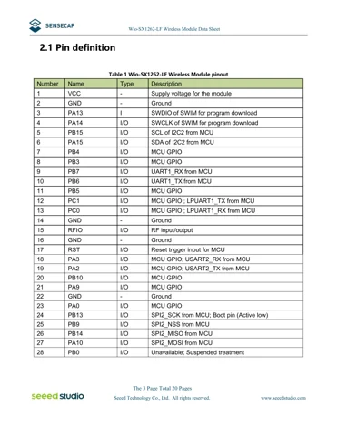
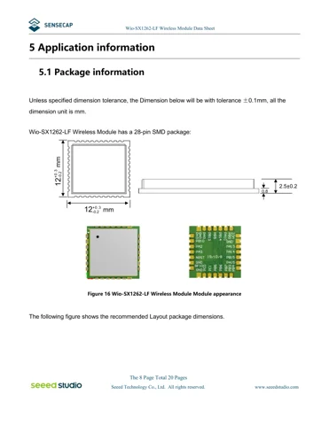

# Wio-SX1262-LF LoRaWAN module

**Seeed Studio** · STM32WLE5JC

Revision: Saved module datasheet V1.1

Coverage: Supporting references; complete physical pinout still needed

[Browse all manufacturers](../../../../BROWSE.md) · [Devices & IoT](../../../../DEVICES.md) · [Open in the browser guide](https://valleytech-black-wire-guide.pages.dev/?board=seeed-wio-sx1262-lf)

## Datasheets and original documentation

Board datasheet: **recorded**. Visual reference: **available**.

[Original manufacturer / project documentation](https://files.seeedstudio.com/products/SenseCAP/100097817/Wio-SX1262-LF%20Datasheet%20V1.1.pdf)

- **datasheet / board**: [Wio-SX1262-LF module datasheet V1.1](https://files.seeedstudio.com/products/SenseCAP/100097817/Wio-SX1262-LF%20Datasheet%20V1.1.pdf) · [saved document](../../../../library/media/e3b555de7193078505ec7c2e855cbb0cba5e500cbfe71b2e477ed462bc7ad1c7.pdf)

Source identity and visual scope reviewed. Pin assignments and electrical limits are not independently bench-verified. Match the exact PCB revision, connector view and populated options. Despite the product name, this LF module document identifies STM32WLE5JC and 28 SMT contacts. It is not the 12-pin Wio-SX1262 HF add-on board. Keep region, antenna connector and interface variants separate.

[Documentation coverage and remaining gaps](../../../../DOCUMENTATION.md)

## Wio-SX1262-LF module datasheet V1.1

**original reference PDF** · Source visual inspected; independent electrical and all-pin completeness review pending · PDF

[Open original reference](../../../../library/media/e3b555de7193078505ec7c2e855cbb0cba5e500cbfe71b2e477ed462bc7ad1c7.pdf)

**Credit and rights:** Seeed Studio / original artwork contributors. Asset-specific redistribution and print rights are not established; Black Wire licenses do not relicense this source artwork.. Source/manufacturer: Seeed Studio.

[Source 1](https://files.seeedstudio.com/products/SenseCAP/100097817/Wio-SX1262-LF%20Datasheet%20V1.1.pdf) · [Source 2](https://wiki.seeedstudio.com/wio_sx1262/)

Source identity and visual scope reviewed. Pin assignments and electrical limits are not independently bench-verified. Match the exact PCB revision, connector view and populated options. Despite the product name, this LF module document identifies STM32WLE5JC and 28 SMT contacts. It is not the 12-pin Wio-SX1262 HF add-on board. Keep region, antenna connector and interface variants separate.

Image revision: Saved module datasheet V1.1

SHA-256: `e3b555de7193078505ec7c2e855cbb0cba5e500cbfe71b2e477ed462bc7ad1c7`

## Wio-SX1262-LF — 28-contact function table

**pin function reference** · Source visual inspected; independent electrical and all-pin completeness review pending · PNG

[Open original reference](../../../../library/media/4e95462286b2be7c4718a2f81dc95a1670689d2866510b6e7a4d82942c7ccaa1.png)

**Credit and rights:** Seeed Studio / original artwork contributors. Asset-specific redistribution and print rights are not established; Black Wire licenses do not relicense this source artwork.. Source/manufacturer: Seeed Studio.

[Source 1](https://files.seeedstudio.com/products/SenseCAP/100097817/Wio-SX1262-LF%20Datasheet%20V1.1.pdf) · [Source 2](https://wiki.seeedstudio.com/wio_sx1262/)

Source identity and visual scope reviewed. Pin assignments and electrical limits are not independently bench-verified. Match the exact PCB revision, connector view and populated options. Despite the product name, this LF module document identifies STM32WLE5JC and 28 SMT contacts. It is not the 12-pin Wio-SX1262 HF add-on board. Keep region, antenna connector and interface variants separate.

Image revision: Saved module datasheet V1.1

SHA-256: `4e95462286b2be7c4718a2f81dc95a1670689d2866510b6e7a4d82942c7ccaa1`

## Wio-SX1262-LF — physical module outline and land pattern

**mechanical drawing** · Source visual inspected; independent electrical and all-pin completeness review pending · PNG

[Open original reference](../../../../library/media/dee69319f6e0ffa7dee3280d2ac5b1a98b3c5faca5337ea7c61f0e52609ab373.png)

**Credit and rights:** Seeed Studio / original artwork contributors. Asset-specific redistribution and print rights are not established; Black Wire licenses do not relicense this source artwork.. Source/manufacturer: Seeed Studio.

[Source 1](https://files.seeedstudio.com/products/SenseCAP/100097817/Wio-SX1262-LF%20Datasheet%20V1.1.pdf) · [Source 2](https://wiki.seeedstudio.com/wio_sx1262/)

Source identity and visual scope reviewed. Pin assignments and electrical limits are not independently bench-verified. Match the exact PCB revision, connector view and populated options. Despite the product name, this LF module document identifies STM32WLE5JC and 28 SMT contacts. It is not the 12-pin Wio-SX1262 HF add-on board. Keep region, antenna connector and interface variants separate.

Image revision: Saved module datasheet V1.1

SHA-256: `dee69319f6e0ffa7dee3280d2ac5b1a98b3c5faca5337ea7c61f0e52609ab373`

Pin assignments have not been independently electrically verified. Check board revision before wiring.
