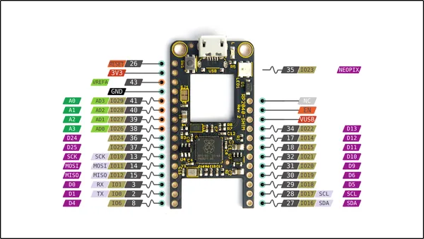

# RP2040-Shim

**Silicognition LLC** · RP2040

Revision: Not identified  
Coverage: Pinout image collected

[Browse all manufacturers](../../../../BROWSE.md) · [Desktop app](https://github.com/valleytechsolutions/black-wire-desktop)

## Physical board pinout

**pinout image** · Reviewed source · PNG

[Open original reference](../../../../library/media/529e98c173431e38d648928e16599a50a560a96a1d8c163bce5af4c370601998.png)

**Credit and rights:** Not established; source attribution retained. Source/manufacturer: Silicognition LLC.

[Source 1](https://raw.githubusercontent.com/xorbit/RP2040-Shim/master/RP2040-Shim-pinout.png) · [Source 2](https://github.com/xorbit/RP2040-Shim)

Discovered from CircuitPython board metadata and the linked product/documentation page. Exact hardware revision requires matching to the diagram.

SHA-256: `529e98c173431e38d648928e16599a50a560a96a1d8c163bce5af4c370601998`

Pin assignments have not been independently electrically verified. Check board revision before wiring.
