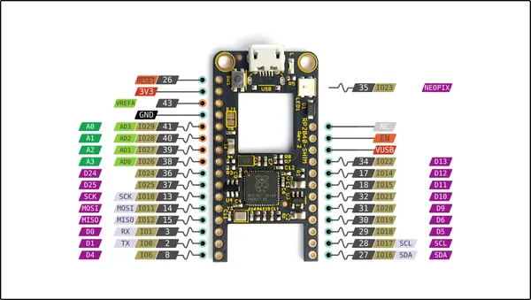

# RP2040-Shim

**Silicognition LLC** · RP2040

Revision: Not identified

Coverage: Pinout image collected

[Browse all manufacturers](../../../../BROWSE.md) · [Devices & IoT](../../../../DEVICES.md) · [Open in the browser guide](https://valleytech-black-wire-guide.pages.dev/?board=silicognition-llc-rp2040-rp2040-shim)

## Datasheets and original documentation

Board datasheet: **not yet recorded**. Visual reference: **available**.

Original manufacturer website still needs identification.

A chip datasheet, schematic and board datasheet have different scopes. Match the exact hardware revision.

[Documentation coverage and remaining gaps](../../../../DOCUMENTATION.md)

## Physical board pinout

**pinout image** · Reviewed source · PNG

[Open original reference](../../../../library/media/529e98c173431e38d648928e16599a50a560a96a1d8c163bce5af4c370601998.png)

**Credit and rights:** Not established; source attribution retained. Source/manufacturer: Silicognition LLC.

[Source 1](https://raw.githubusercontent.com/xorbit/RP2040-Shim/master/RP2040-Shim-pinout.png) · [Source 2](https://github.com/xorbit/RP2040-Shim)

Discovered from CircuitPython board metadata and the linked product/documentation page. Exact hardware revision requires matching to the diagram.

Image revision: Not identified

SHA-256: `529e98c173431e38d648928e16599a50a560a96a1d8c163bce5af4c370601998`

Pin assignments have not been independently electrically verified. Check board revision before wiring.
