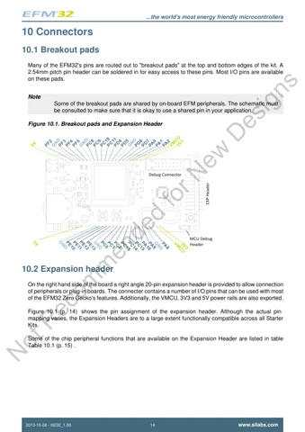
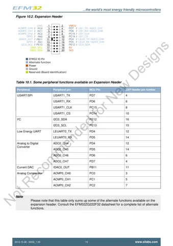
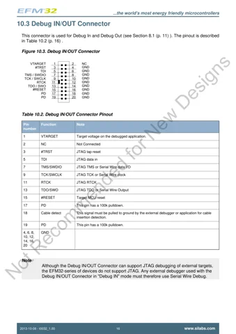
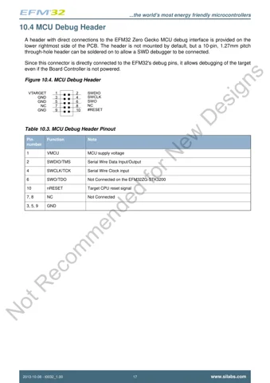

# EFM32 Zero Gecko Starter Kit / EFM32ZG-STK3200

**Silicon Labs** · EFM32ZG222F32

Revision: Not identified

Coverage: Physical pinout reference; independent completeness review pending

[Browse all manufacturers](../../../../BROWSE.md) · [Devices & IoT](../../../../DEVICES.md) · [Open in the browser guide](https://valleytech-black-wire-guide.pages.dev/?board=silabs-efm32zg-stk3200)

Architecture: **ARM**

## Datasheets and original documentation

Board datasheet: **not yet recorded**. Visual reference: **available**.

[Original manufacturer product documentation](https://www.silabs.com/development-tools/mcu/32-bit/efm32zg-starter-kit)

- **hardware-guide / board**: [Manufacturer hardware guide / connector reference](https://www.silabs.com/documents/public/user-guides/efm32zg-stk3200-ug.pdf) · [saved document](../../../../library/media/97b5190abbadb6481f082c01718ab57c62fc296aa1d4c151fd51943c5862a9f8.pdf)

Original source reviewed for model and visual type. Pin assignments and electrical limits have not been independently verified. Match the PCB revision before wiring. Manufacturer marks this older platform Not Recommended for New Designs. Pages separate breakout pads, expansion header and debug connectors.

[Documentation coverage and remaining gaps](../../../../DOCUMENTATION.md)

## Specifications and hardware documentation

- [Original model specifications](https://www.silabs.com/development-tools/mcu/32-bit/efm32zg-starter-kit)

## Original manufacturer hardware guide

**original reference PDF** · Reviewed source · PDF

[Open original reference](../../../../library/media/97b5190abbadb6481f082c01718ab57c62fc296aa1d4c151fd51943c5862a9f8.pdf)

**Credit and rights:** Silicon Labs / original artwork contributors. Asset-specific redistribution and print rights are not established. Black Wire's editorial license does not relicense this artwork.. Source/manufacturer: Silicon Labs.

[Source 1](https://www.silabs.com/documents/public/user-guides/efm32zg-stk3200-ug.pdf) · [Source 2](https://www.silabs.com/development-tools/mcu/32-bit/efm32zg-starter-kit)

Original source reviewed for model and visual type. Pin assignments and electrical limits have not been independently verified. Match the PCB revision before wiring.

Image revision: Not identified

SHA-256: `97b5190abbadb6481f082c01718ab57c62fc296aa1d4c151fd51943c5862a9f8`

## Manufacturer GPIO / connector reference — page 14

**pinout image** · Reviewed source · PNG

[Open original reference](../../../../library/media/86ad3e702fe289d5e9c2bae33ce28d4c6024e9a077b02557fa1338674d9c2e36.png)

**Credit and rights:** Silicon Labs / original artwork contributors. Asset-specific redistribution and print rights are not established. Black Wire's editorial license does not relicense this artwork.. Source/manufacturer: Silicon Labs.

[Source 1](https://www.silabs.com/documents/public/user-guides/efm32zg-stk3200-ug.pdf) · [Source 2](https://www.silabs.com/development-tools/mcu/32-bit/efm32zg-starter-kit)

Original source reviewed for model and visual type. Pin assignments and electrical limits have not been independently verified. Match the PCB revision before wiring. Manufacturer marks this older platform Not Recommended for New Designs. Pages separate breakout pads, expansion header and debug connectors.

Image revision: Not identified

SHA-256: `86ad3e702fe289d5e9c2bae33ce28d4c6024e9a077b02557fa1338674d9c2e36`

## Manufacturer GPIO / connector reference — page 15

**connector reference** · Reviewed source · PNG

[Open original reference](../../../../library/media/4a5d27bd76d2aa1d3347a860adb11dda98c830152aedeafa41979646351400a5.png)

**Credit and rights:** Silicon Labs / original artwork contributors. Asset-specific redistribution and print rights are not established. Black Wire's editorial license does not relicense this artwork.. Source/manufacturer: Silicon Labs.

[Source 1](https://www.silabs.com/documents/public/user-guides/efm32zg-stk3200-ug.pdf) · [Source 2](https://www.silabs.com/development-tools/mcu/32-bit/efm32zg-starter-kit)

Original source reviewed for model and visual type. Pin assignments and electrical limits have not been independently verified. Match the PCB revision before wiring. Manufacturer marks this older platform Not Recommended for New Designs. Pages separate breakout pads, expansion header and debug connectors.

Image revision: Not identified

SHA-256: `4a5d27bd76d2aa1d3347a860adb11dda98c830152aedeafa41979646351400a5`

## Manufacturer GPIO / connector reference — page 16

**connector reference** · Reviewed source · PNG

[Open original reference](../../../../library/media/f63e8650ee22fb9e41777f1c50cefc49670ab398cff3fcc7431457156fd2787f.png)

**Credit and rights:** Silicon Labs / original artwork contributors. Asset-specific redistribution and print rights are not established. Black Wire's editorial license does not relicense this artwork.. Source/manufacturer: Silicon Labs.

[Source 1](https://www.silabs.com/documents/public/user-guides/efm32zg-stk3200-ug.pdf) · [Source 2](https://www.silabs.com/development-tools/mcu/32-bit/efm32zg-starter-kit)

Original source reviewed for model and visual type. Pin assignments and electrical limits have not been independently verified. Match the PCB revision before wiring. Manufacturer marks this older platform Not Recommended for New Designs. Pages separate breakout pads, expansion header and debug connectors.

Image revision: Not identified

SHA-256: `f63e8650ee22fb9e41777f1c50cefc49670ab398cff3fcc7431457156fd2787f`

## Manufacturer GPIO / connector reference — page 17

**connector reference** · Reviewed source · PNG

[Open original reference](../../../../library/media/9d0902d3365d3d4a8569d3f4ea810567013c48b3e0694db6f14e62ec9c535c7a.png)

**Credit and rights:** Silicon Labs / original artwork contributors. Asset-specific redistribution and print rights are not established. Black Wire's editorial license does not relicense this artwork.. Source/manufacturer: Silicon Labs.

[Source 1](https://www.silabs.com/documents/public/user-guides/efm32zg-stk3200-ug.pdf) · [Source 2](https://www.silabs.com/development-tools/mcu/32-bit/efm32zg-starter-kit)

Original source reviewed for model and visual type. Pin assignments and electrical limits have not been independently verified. Match the PCB revision before wiring. Manufacturer marks this older platform Not Recommended for New Designs. Pages separate breakout pads, expansion header and debug connectors.

Image revision: Not identified

SHA-256: `9d0902d3365d3d4a8569d3f4ea810567013c48b3e0694db6f14e62ec9c535c7a`

Pin assignments have not been independently electrically verified. Check board revision before wiring.
