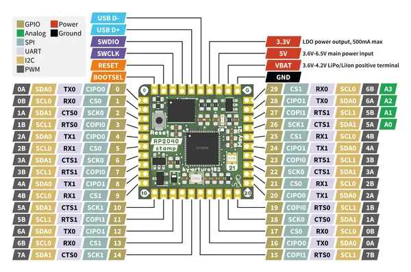

# RP2040 STAMP

**Solder Party** · RP2040

Revision: Not identified  
Coverage: Pinout image collected

[Browse all manufacturers](../../../../BROWSE.md) · [Desktop app](https://github.com/valleytechsolutions/black-wire-desktop)

## Manufacturer pinout reference

**pinout image** · Reviewed source · PNG

[Open original reference](../../../../library/media/15d8d5c0dff314bc240bb82af576e5be4effffe985f7e2dc11a4337d7e82b4f1.png)

**Credit and rights:** Not established; source attribution retained. Source/manufacturer: Solder Party.

[Source 1](https://www.solder.party/docs/rp2040-stamp/leaflet_rp2040_stamp.png) · [Source 2](https://www.solder.party/docs/rp2xxx-stamp-related/rp2040-stamp/downloads/)

SHA-256: `15d8d5c0dff314bc240bb82af576e5be4effffe985f7e2dc11a4337d7e82b4f1`

Pin assignments have not been independently electrically verified. Check board revision before wiring.
