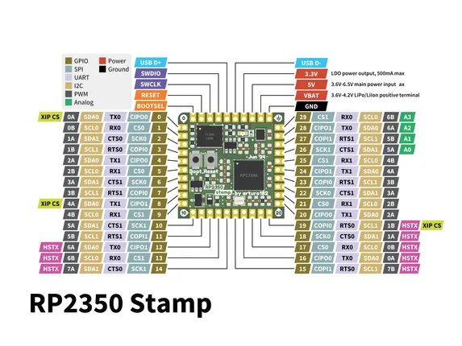

# RP2350 STAMP

**Solder Party** · RP2350

Revision: Not identified  
Coverage: Pinout image collected

[Browse all manufacturers](../../../../BROWSE.md) · [Desktop app](https://github.com/valleytechsolutions/black-wire-desktop)

## Manufacturer pinout reference

**pinout image** · Reviewed source · PNG

[Open original reference](../../../../library/media/7b3bae8ca9de76795932f1dfa9b0f9ac3cbe0b82c29758a8d5a5de21b7cfc9ef.png)

**Credit and rights:** Not established; source attribution retained. Source/manufacturer: Solder Party.

[Source 1](https://www.solder.party/docs/rp2350-stamp/leaflet_rp2350_stamp.png) · [Source 2](https://www.solder.party/docs/rp2xxx-stamp-related/rp2350-stamp/downloads/)

SHA-256: `7b3bae8ca9de76795932f1dfa9b0f9ac3cbe0b82c29758a8d5a5de21b7cfc9ef`

Pin assignments have not been independently electrically verified. Check board revision before wiring.
