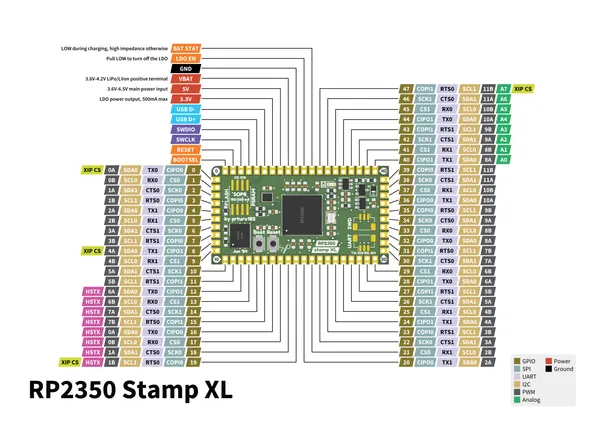

# RP2350 STAMP XL

**Solder Party** · RP2350

Revision: Not identified

Coverage: Pinout image collected

[Browse all manufacturers](../../../../BROWSE.md) · [Devices & IoT](../../../../DEVICES.md) · [Open in the browser guide](https://valleytech-black-wire-guide.pages.dev/?board=solder-party-rp2350-rp2350-stamp-xl)

## Datasheets and original documentation

Board datasheet: **not yet recorded**. Visual reference: **available**.

Original manufacturer website still needs identification.

A chip datasheet, schematic and board datasheet have different scopes. Match the exact hardware revision.

[Documentation coverage and remaining gaps](../../../../DOCUMENTATION.md)

## Manufacturer pinout reference

**pinout image** · Reviewed source · PNG

[Open original reference](../../../../library/media/81a3951727d626e8957441b9ab2a6c30d198e9e8875ebf48a32b842133335db3.png)

**Credit and rights:** Not established; source attribution retained. Source/manufacturer: Solder Party.

[Source 1](https://www.solder.party/docs/rp2350-stamp-xl/leaflet_rp2350_stamp_xl.png) · [Source 2](https://www.solder.party/docs/rp2xxx-stamp-related/rp2350-stamp-xl/downloads/)

Image revision: Not identified

SHA-256: `81a3951727d626e8957441b9ab2a6c30d198e9e8875ebf48a32b842133335db3`

Pin assignments have not been independently electrically verified. Check board revision before wiring.
