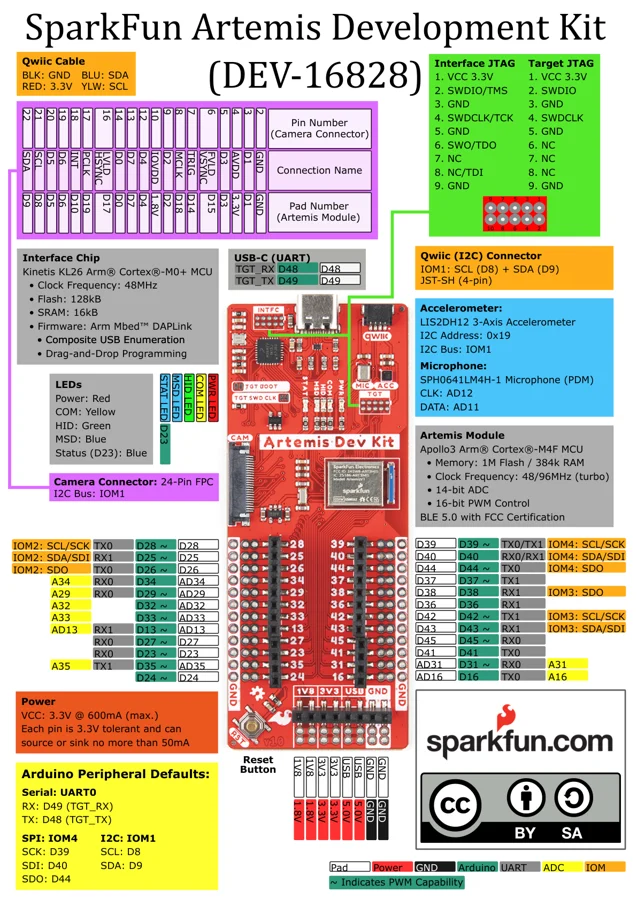

# Artemis Development Kit

**SparkFun** · Apollo3

Revision: Not identified

Coverage: Physical pinout source collected; scope and revision require confirmation

[Browse all manufacturers](../../../../BROWSE.md) · [Devices & IoT](../../../../DEVICES.md) · [Open in the browser guide](https://valleytech-black-wire-guide.pages.dev/?board=sparkfun-artemis-development-kit)

## Specifications and hardware documentation

- [Manufacturer hardware repository](https://github.com/sparkfun/ArtemisDevKit)

## Original manufacturer graphical reference (PDF)

**original reference PDF** · Reviewed source · PDF

[Open original reference](../../../../library/media/0ec3660aff849f62e9e647339a668342771747ac798b5fc22c7b4c641589743a.pdf)

**Credit and rights:** SparkFun / original diagram contributors. Rights not established for this asset; attribution retained. Original artwork is not covered by Black Wire's editorial license.. Source/manufacturer: SparkFun.

[Source 1](https://raw.githubusercontent.com/sparkfun/ArtemisDevKit/4d5afc951a0887709fc2ba3bf365e2c71c42151a/reference/Graphical_Datasheet_Artemis_DK.pdf) · [Source 2](https://github.com/sparkfun/ArtemisDevKit) · [Source 3](https://github.com/sparkfun/ArtemisDevKit/tree/4d5afc951a0887709fc2ba3bf365e2c71c42151a)

Original publisher reference. Exact board/revision and electrical limits still require confirmation.

Image revision: Not identified

SHA-256: `0ec3660aff849f62e9e647339a668342771747ac798b5fc22c7b4c641589743a`

## Manufacturer board pinout — page 1

**pinout image** · Reviewed source · PNG

[Open original reference](../../../../library/media/49e6b89ed8f8d81dce59b076d6e1fa1eb11a3a0bb114bea45a67f48f8c843214.png)

**Credit and rights:** SparkFun / original diagram contributors. Rights not established for this asset; attribution retained. Original artwork is not covered by Black Wire's editorial license.. Source/manufacturer: SparkFun.

[Source 1](https://raw.githubusercontent.com/sparkfun/ArtemisDevKit/4d5afc951a0887709fc2ba3bf365e2c71c42151a/reference/Graphical_Datasheet_Artemis_DK.pdf) · [Source 2](https://github.com/sparkfun/ArtemisDevKit) · [Source 3](https://github.com/sparkfun/ArtemisDevKit/tree/4d5afc951a0887709fc2ba3bf365e2c71c42151a)

Original publisher reference. Exact board/revision and electrical limits still require confirmation.  PDF page rendered at 144 dpi without changing labels. Original vector PDF retained.

Image revision: Not identified

SHA-256: `49e6b89ed8f8d81dce59b076d6e1fa1eb11a3a0bb114bea45a67f48f8c843214`

Pin assignments have not been independently electrically verified. Check board revision before wiring.
