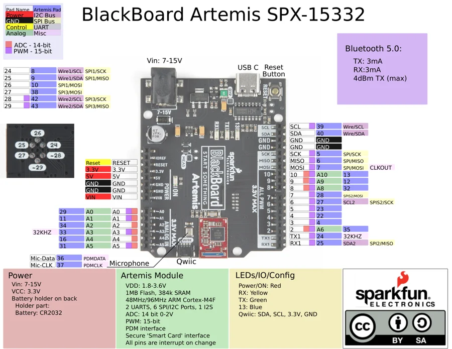

# BlackBoard Artemis

**SparkFun** · Apollo3

Revision: Not identified

Coverage: Physical pinout source collected; scope and revision require confirmation

[Browse all manufacturers](../../../../BROWSE.md) · [Devices & IoT](../../../../DEVICES.md) · [Open in the browser guide](https://valleytech-black-wire-guide.pages.dev/?board=sparkfun-blackboard-artemis)

## Specifications and hardware documentation

- [Original BlackBoard Artemis hardware guide](https://learn.sparkfun.com/tutorials/hookup-guide-for-the-blackboard-artemis/all)

## Original manufacturer graphical reference (PDF)

**original reference PDF** · Reviewed source · PDF

[Open original reference](../../../../library/media/296064ae7aa80e4e87c8a1b7cac40367d936bbd855e00c1348f004a8b8d7f871.pdf)

**Credit and rights:** SparkFun Electronics / graphical datasheet contributors. CC BY-SA marking retained in the original; verify the applicable version in the source repository before redistribution.. Source/manufacturer: SparkFun.

[Source 1](https://raw.githubusercontent.com/sparkfun/Graphical_Datasheets/736369896be44fae46b1e04bd370dd88ef73a227/Datasheets/Artemis/Artemis%20Blackboard/ArtemisBlackboard.pdf) · [Source 2](https://www.sparkfun.com/products/15332) · [Source 3](https://github.com/sparkfun/Graphical_Datasheets/tree/736369896be44fae46b1e04bd370dd88ef73a227)

Original publisher reference. Exact board/revision and electrical limits still require confirmation.

Image revision: Not identified

SHA-256: `296064ae7aa80e4e87c8a1b7cac40367d936bbd855e00c1348f004a8b8d7f871`

## Manufacturer board pinout — page 1

**pinout image** · Reviewed source · PNG

[Open original reference](../../../../library/media/d9523dfc6a66653a89c73a472795d480f673467c63c17694fcc9371cc01d333f.png)

**Credit and rights:** SparkFun Electronics / graphical datasheet contributors. CC BY-SA marking retained in the original; verify the applicable version in the source repository before redistribution.. Source/manufacturer: SparkFun.

[Source 1](https://raw.githubusercontent.com/sparkfun/Graphical_Datasheets/736369896be44fae46b1e04bd370dd88ef73a227/Datasheets/Artemis/Artemis%20Blackboard/ArtemisBlackboard.pdf) · [Source 2](https://www.sparkfun.com/products/15332) · [Source 3](https://github.com/sparkfun/Graphical_Datasheets/tree/736369896be44fae46b1e04bd370dd88ef73a227)

Original publisher reference. Exact board/revision and electrical limits still require confirmation.  PDF page rendered at 144 dpi without changing labels. Original vector PDF retained.

Image revision: Not identified

SHA-256: `d9523dfc6a66653a89c73a472795d480f673467c63c17694fcc9371cc01d333f`

Pin assignments have not been independently electrically verified. Check board revision before wiring.
