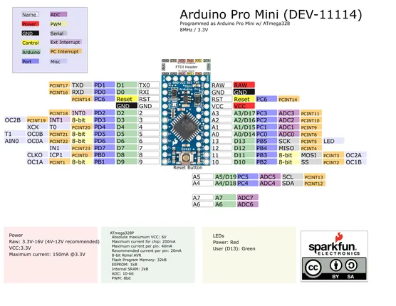

# Arduino Pro Mini 328 - 3.3V 8MHz

**SparkFun** · ATmega328P

Revision: Not identified  
Coverage: Pinout image collected

[Browse all manufacturers](../../../../BROWSE.md) · [Desktop app](https://github.com/valleytechsolutions/black-wire-desktop)

## Board pinout - original PDF page 1

**pinout image** · Reviewed source · PNG

[Open original reference](../../../../library/media/a258bcfb9862d20f0ae23182cf9a0fca5bb33486db9008f74c5c5784f1f982df.png)

**Credit and rights:** Not established; source attribution retained. Source/manufacturer: SparkFun.

[Source 1](https://raw.githubusercontent.com/sparkfun/Arduino_Pro_Mini_328/bcf8de441f8ebe9e21377c4a0d12794670dc2551/Documentation/ProMini8MHzv2.pdf) · [Source 2](https://github.com/sparkfun/Arduino_Pro_Mini_328) · [Source 3](https://learn.sparkfun.com/tutorials/using-the-arduino-pro-mini-33v/all)

Original SparkFun Arduino Pro Mini model; voltage/clock variants kept separately. Does not establish clone compatibility. Original PDF page 1 rendered at 220 dpi; no labels changed.

SHA-256: `a258bcfb9862d20f0ae23182cf9a0fca5bb33486db9008f74c5c5784f1f982df`

## Graphical board datasheet

**original reference PDF** · Reviewed source · PDF

[Open original reference](../../../../library/media/cf0d8ef5399171b0996b091656ee12693026c9838ae275e7d8e4630e894de475.pdf)

**Credit and rights:** Not established; source attribution retained. Source/manufacturer: SparkFun.

[Source 1](https://raw.githubusercontent.com/sparkfun/Arduino_Pro_Mini_328/bcf8de441f8ebe9e21377c4a0d12794670dc2551/Documentation/ProMini8MHzv2.pdf) · [Source 2](https://github.com/sparkfun/Arduino_Pro_Mini_328) · [Source 3](https://learn.sparkfun.com/tutorials/using-the-arduino-pro-mini-33v/all)

Original SparkFun Arduino Pro Mini model; voltage/clock variants kept separately. Does not establish clone compatibility.

SHA-256: `cf0d8ef5399171b0996b091656ee12693026c9838ae275e7d8e4630e894de475`

Pin assignments have not been independently electrically verified. Check board revision before wiring.
