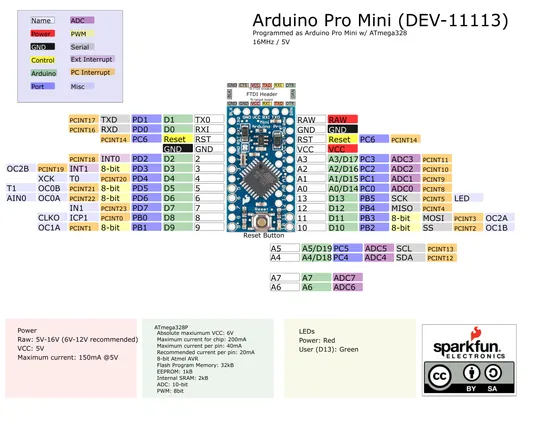

# Arduino Pro Mini 328 - 5V 16MHz

**SparkFun** · ATmega328P

Revision: Not identified  
Coverage: Pinout image collected

[Browse all manufacturers](../../../../BROWSE.md) · [Desktop app](https://github.com/valleytechsolutions/black-wire-desktop)

## Board pinout - original PDF page 1

**pinout image** · Reviewed source · PNG

[Open original reference](../../../../library/media/c0b4b7025c2dab454531d1c402c81a9231cc75c47d5239165fea151e7ead6f93.png)

**Credit and rights:** Not established; source attribution retained. Source/manufacturer: SparkFun.

[Source 1](https://raw.githubusercontent.com/sparkfun/Arduino_Pro_Mini_328/bcf8de441f8ebe9e21377c4a0d12794670dc2551/Documentation/ProMini16MHzv2.pdf) · [Source 2](https://github.com/sparkfun/Arduino_Pro_Mini_328) · [Source 3](https://learn.sparkfun.com/tutorials/using-the-arduino-pro-mini-33v/all)

Original SparkFun Arduino Pro Mini model; voltage/clock variants kept separately. Does not establish clone compatibility. Original PDF page 1 rendered at 220 dpi; no labels changed.

SHA-256: `c0b4b7025c2dab454531d1c402c81a9231cc75c47d5239165fea151e7ead6f93`

## Graphical board datasheet

**original reference PDF** · Reviewed source · PDF

[Open original reference](../../../../library/media/c3fe44383961f745f7a826f96a7323f88fed4addd8ef39f5031c898e9d8a85e0.pdf)

**Credit and rights:** Not established; source attribution retained. Source/manufacturer: SparkFun.

[Source 1](https://raw.githubusercontent.com/sparkfun/Arduino_Pro_Mini_328/bcf8de441f8ebe9e21377c4a0d12794670dc2551/Documentation/ProMini16MHzv2.pdf) · [Source 2](https://github.com/sparkfun/Arduino_Pro_Mini_328) · [Source 3](https://learn.sparkfun.com/tutorials/using-the-arduino-pro-mini-33v/all)

Original SparkFun Arduino Pro Mini model; voltage/clock variants kept separately. Does not establish clone compatibility.

SHA-256: `c3fe44383961f745f7a826f96a7323f88fed4addd8ef39f5031c898e9d8a85e0`

Pin assignments have not been independently electrically verified. Check board revision before wiring.
