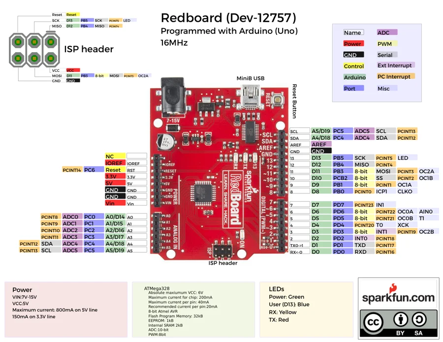

# RedBoard DEV-12757

**SparkFun** · ATmega328P

Revision: Not identified

Coverage: Physical pinout source collected; scope and revision require confirmation

[Browse all manufacturers](../../../../BROWSE.md) · [Devices & IoT](../../../../DEVICES.md) · [Open in the browser guide](https://valleytech-black-wire-guide.pages.dev/?board=sparkfun-redboard-dev-12757)

Architecture: **AVR**

## Specifications and hardware documentation

- [Specifications & hardware guide](https://www.sparkfun.com/products/12757)

## Original manufacturer graphical reference (PDF)

**original reference PDF** · Reviewed source · PDF

[Open original reference](../../../../library/media/52c068a61c9e88cfe62eb9825777cc611de90145f9342229f6f9d3e0a8a4cdd7.pdf)

**Credit and rights:** SparkFun Electronics / graphical datasheet contributors. CC BY-SA marking retained in the original; verify the applicable version in the source repository before redistribution.. Source/manufacturer: SparkFun.

[Source 1](https://raw.githubusercontent.com/sparkfun/Graphical_Datasheets/736369896be44fae46b1e04bd370dd88ef73a227/Datasheets/Redboard/Redboardv1.pdf) · [Source 2](https://www.sparkfun.com/products/12757) · [Source 3](https://github.com/sparkfun/Graphical_Datasheets/tree/736369896be44fae46b1e04bd370dd88ef73a227)

Original publisher reference. Exact board/revision and electrical limits still require confirmation.

Image revision: Not identified

SHA-256: `52c068a61c9e88cfe62eb9825777cc611de90145f9342229f6f9d3e0a8a4cdd7`

## Manufacturer board pinout — page 1

**pinout image** · Reviewed source · PNG

[Open original reference](../../../../library/media/3f8ce2377c95e590d8d993e8b7cffb705ce17a91a5774268fbd3bc1ec0cb6b38.png)

**Credit and rights:** SparkFun Electronics / graphical datasheet contributors. CC BY-SA marking retained in the original; verify the applicable version in the source repository before redistribution.. Source/manufacturer: SparkFun.

[Source 1](https://raw.githubusercontent.com/sparkfun/Graphical_Datasheets/736369896be44fae46b1e04bd370dd88ef73a227/Datasheets/Redboard/Redboardv1.pdf) · [Source 2](https://www.sparkfun.com/products/12757) · [Source 3](https://github.com/sparkfun/Graphical_Datasheets/tree/736369896be44fae46b1e04bd370dd88ef73a227)

Original publisher reference. Exact board/revision and electrical limits still require confirmation.  PDF page rendered at 144 dpi without changing labels. Original vector PDF retained.

Image revision: Not identified

SHA-256: `3f8ce2377c95e590d8d993e8b7cffb705ce17a91a5774268fbd3bc1ec0cb6b38`

Pin assignments have not been independently electrically verified. Check board revision before wiring.
