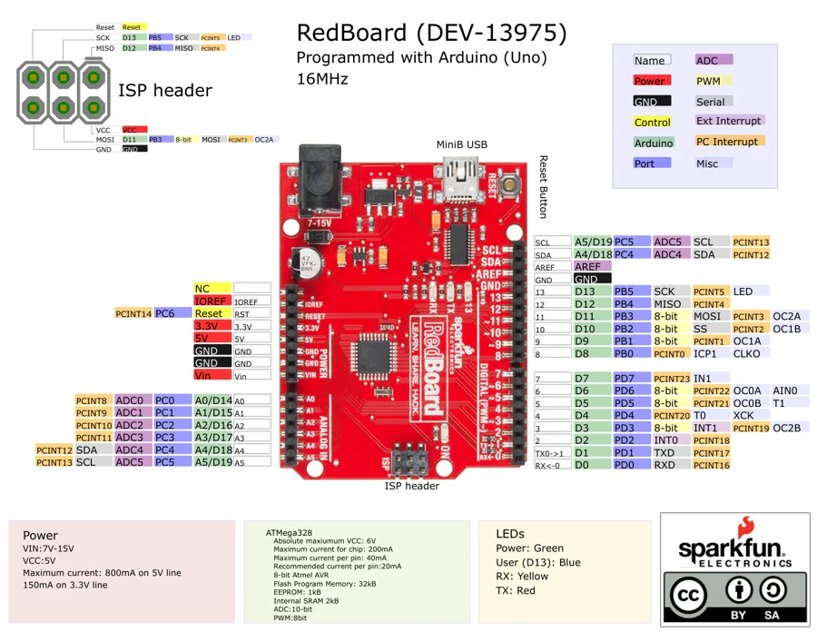

# RedBoard DEV-13975

**SparkFun** · ATmega328P

Revision: Not identified

Coverage: Physical pinout source collected; scope and revision require confirmation

[Browse all manufacturers](../../../../BROWSE.md) · [Devices & IoT](../../../../DEVICES.md) · [Open in the browser guide](https://valleytech-black-wire-guide.pages.dev/?board=sparkfun-redboard-dev-13975)

Architecture: **AVR**

## Specifications and hardware documentation

- [Specifications & hardware guide](https://www.sparkfun.com/products/13975)

## Original manufacturer graphical reference (PDF)

**original reference PDF** · Reviewed source · PDF

[Open original reference](../../../../library/media/1696ca1ee5910cab0006081fc9f7f412a8cc4fb624f0dc1a9b1dead5fda4608a.pdf)

**Credit and rights:** SparkFun Electronics / graphical datasheet contributors. CC BY-SA marking retained in the original; verify the applicable version in the source repository before redistribution.. Source/manufacturer: SparkFun.

[Source 1](https://raw.githubusercontent.com/sparkfun/Graphical_Datasheets/736369896be44fae46b1e04bd370dd88ef73a227/Datasheets/Redboard/Redboardv2.pdf) · [Source 2](https://www.sparkfun.com/products/13975) · [Source 3](https://github.com/sparkfun/Graphical_Datasheets/tree/736369896be44fae46b1e04bd370dd88ef73a227)

Original publisher reference. Exact board/revision and electrical limits still require confirmation.

Image revision: Not identified

SHA-256: `1696ca1ee5910cab0006081fc9f7f412a8cc4fb624f0dc1a9b1dead5fda4608a`

## Manufacturer board pinout — page 1

**pinout image** · Reviewed source · PNG

[Open original reference](../../../../library/media/b3dc6eb7c530ec0046538247bae3077101b299d39e156ec9a2af7a761823b99a.png)

**Credit and rights:** SparkFun Electronics / graphical datasheet contributors. CC BY-SA marking retained in the original; verify the applicable version in the source repository before redistribution.. Source/manufacturer: SparkFun.

[Source 1](https://raw.githubusercontent.com/sparkfun/Graphical_Datasheets/736369896be44fae46b1e04bd370dd88ef73a227/Datasheets/Redboard/Redboardv2.pdf) · [Source 2](https://www.sparkfun.com/products/13975) · [Source 3](https://github.com/sparkfun/Graphical_Datasheets/tree/736369896be44fae46b1e04bd370dd88ef73a227)

Original publisher reference. Exact board/revision and electrical limits still require confirmation.  PDF page rendered at 144 dpi without changing labels. Original vector PDF retained.

Image revision: Not identified

SHA-256: `b3dc6eb7c530ec0046538247bae3077101b299d39e156ec9a2af7a761823b99a`

Pin assignments have not been independently electrically verified. Check board revision before wiring.
