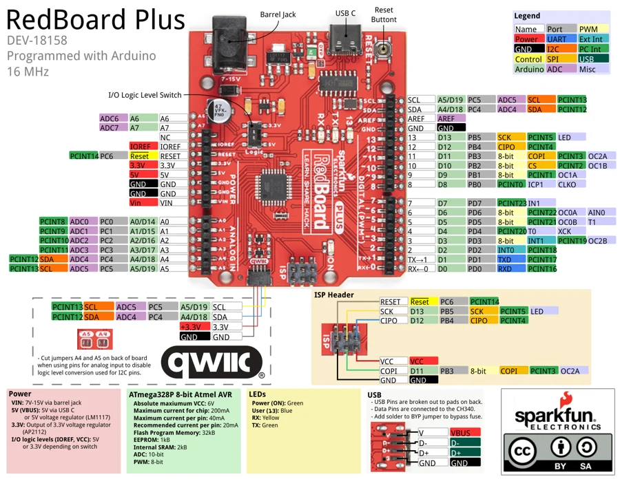

# RedBoard Plus

**SparkFun** · ATmega328P

Revision: Not identified

Coverage: Physical pinout source collected; scope and revision require confirmation

[Browse all manufacturers](../../../../BROWSE.md) · [Devices & IoT](../../../../DEVICES.md) · [Open in the browser guide](https://valleytech-black-wire-guide.pages.dev/?board=sparkfun-redboard-plus)

Architecture: **AVR**

## Specifications and hardware documentation

- [Specifications & hardware guide](https://www.sparkfun.com/products/18158)

## Original manufacturer graphical reference (PDF)

**original reference PDF** · Reviewed source · PDF

[Open original reference](../../../../library/media/fd6c905d92b3fcfadae95c8eb9410c63cee916ae9b71dd83762f406b6332348e.pdf)

**Credit and rights:** SparkFun Electronics / graphical datasheet contributors. CC BY-SA marking retained in the original; verify the applicable version in the source repository before redistribution.. Source/manufacturer: SparkFun.

[Source 1](https://raw.githubusercontent.com/sparkfun/Graphical_Datasheets/736369896be44fae46b1e04bd370dd88ef73a227/Datasheets/Redboard/RedBoard%20Plus.pdf) · [Source 2](https://www.sparkfun.com/products/18158) · [Source 3](https://github.com/sparkfun/Graphical_Datasheets/tree/736369896be44fae46b1e04bd370dd88ef73a227)

Original publisher reference. Exact board/revision and electrical limits still require confirmation.

Image revision: Not identified

SHA-256: `fd6c905d92b3fcfadae95c8eb9410c63cee916ae9b71dd83762f406b6332348e`

## Manufacturer board pinout — page 1

**pinout image** · Reviewed source · PNG

[Open original reference](../../../../library/media/6b72e7e60b1a4452263ea2126e08b29aed4d1d3bde1b0f0c89156f78b713b8b6.png)

**Credit and rights:** SparkFun Electronics / graphical datasheet contributors. CC BY-SA marking retained in the original; verify the applicable version in the source repository before redistribution.. Source/manufacturer: SparkFun.

[Source 1](https://raw.githubusercontent.com/sparkfun/Graphical_Datasheets/736369896be44fae46b1e04bd370dd88ef73a227/Datasheets/Redboard/RedBoard%20Plus.pdf) · [Source 2](https://www.sparkfun.com/products/18158) · [Source 3](https://github.com/sparkfun/Graphical_Datasheets/tree/736369896be44fae46b1e04bd370dd88ef73a227)

Original publisher reference. Exact board/revision and electrical limits still require confirmation.  PDF page rendered at 144 dpi without changing labels. Original vector PDF retained.

Image revision: Not identified

SHA-256: `6b72e7e60b1a4452263ea2126e08b29aed4d1d3bde1b0f0c89156f78b713b8b6`

Pin assignments have not been independently electrically verified. Check board revision before wiring.
