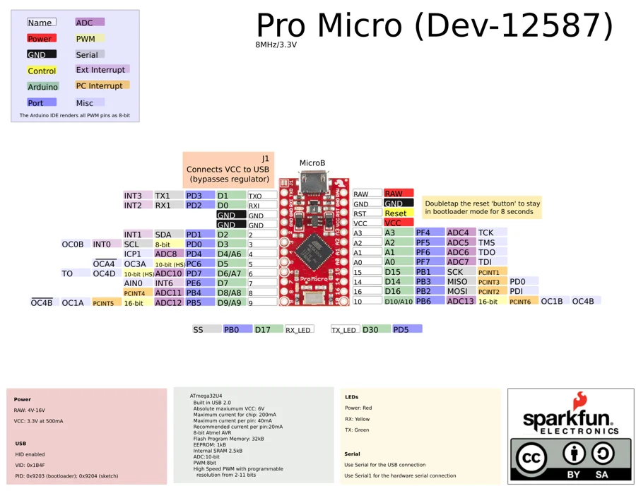

# Pro Micro 3.3V 8MHz

**SparkFun** · ATmega32U4

Revision: Not identified

Coverage: Physical pinout source collected; scope and revision require confirmation

[Browse all manufacturers](../../../../BROWSE.md) · [Devices & IoT](../../../../DEVICES.md) · [Open in the browser guide](https://valleytech-black-wire-guide.pages.dev/?board=sparkfun-pro-micro-3-3v-8mhz)

Architecture: **AVR**

## Specifications and hardware documentation

- [Specifications & hardware guide](https://www.sparkfun.com/products/12587)

## Original manufacturer graphical reference (PDF)

**original reference PDF** · Reviewed source · PDF

[Open original reference](../../../../library/media/3f3701ba4db870be60af8e46cf61d69f8bd0c5d218969a7b5f2c419487e6c848.pdf)

**Credit and rights:** SparkFun Electronics / graphical datasheet contributors. CC BY-SA marking retained in the original; verify the applicable version in the source repository before redistribution.. Source/manufacturer: SparkFun.

[Source 1](https://raw.githubusercontent.com/sparkfun/Graphical_Datasheets/736369896be44fae46b1e04bd370dd88ef73a227/Datasheets/ProMicro/ProMicro8MHzv2.pdf) · [Source 2](https://www.sparkfun.com/products/12587) · [Source 3](https://github.com/sparkfun/Graphical_Datasheets/tree/736369896be44fae46b1e04bd370dd88ef73a227)

Original publisher reference. Exact board/revision and electrical limits still require confirmation.

Image revision: Not identified

SHA-256: `3f3701ba4db870be60af8e46cf61d69f8bd0c5d218969a7b5f2c419487e6c848`

## Manufacturer board pinout — page 1

**pinout image** · Reviewed source · PNG

[Open original reference](../../../../library/media/abe9f90c22a59b63254389e452818b0b812debde06180b94c70096a05b8ae733.png)

**Credit and rights:** SparkFun Electronics / graphical datasheet contributors. CC BY-SA marking retained in the original; verify the applicable version in the source repository before redistribution.. Source/manufacturer: SparkFun.

[Source 1](https://raw.githubusercontent.com/sparkfun/Graphical_Datasheets/736369896be44fae46b1e04bd370dd88ef73a227/Datasheets/ProMicro/ProMicro8MHzv2.pdf) · [Source 2](https://www.sparkfun.com/products/12587) · [Source 3](https://github.com/sparkfun/Graphical_Datasheets/tree/736369896be44fae46b1e04bd370dd88ef73a227)

Original publisher reference. Exact board/revision and electrical limits still require confirmation.  PDF page rendered at 144 dpi without changing labels. Original vector PDF retained.

Image revision: Not identified

SHA-256: `abe9f90c22a59b63254389e452818b0b812debde06180b94c70096a05b8ae733`

Pin assignments have not been independently electrically verified. Check board revision before wiring.
