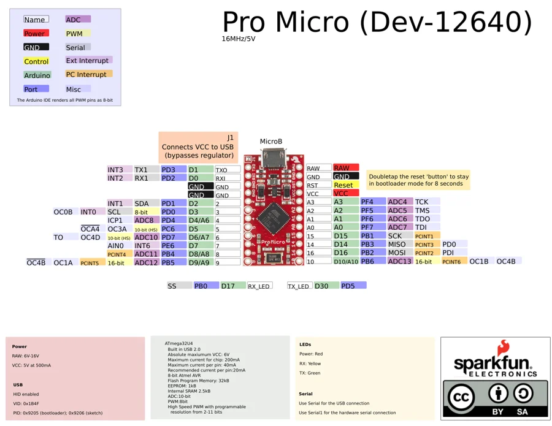

# Pro Micro 5V 16MHz

**SparkFun** · ATmega32U4

Revision: Not identified

Coverage: Physical pinout source collected; scope and revision require confirmation

[Browse all manufacturers](../../../../BROWSE.md) · [Devices & IoT](../../../../DEVICES.md) · [Open in the browser guide](https://valleytech-black-wire-guide.pages.dev/?board=sparkfun-pro-micro-5v-16mhz)

Architecture: **AVR**

## Specifications and hardware documentation

- [Specifications & hardware guide](https://www.sparkfun.com/products/12640)

## Original manufacturer graphical reference (PDF)

**original reference PDF** · Reviewed source · PDF

[Open original reference](../../../../library/media/d87d7caecc495b4b361672ea35f780706b05261a641228237a3fe6330e11960e.pdf)

**Credit and rights:** SparkFun Electronics / graphical datasheet contributors. CC BY-SA marking retained in the original; verify the applicable version in the source repository before redistribution.. Source/manufacturer: SparkFun.

[Source 1](https://raw.githubusercontent.com/sparkfun/Graphical_Datasheets/736369896be44fae46b1e04bd370dd88ef73a227/Datasheets/ProMicro/ProMicro16MHzv2.pdf) · [Source 2](https://www.sparkfun.com/products/12640) · [Source 3](https://github.com/sparkfun/Graphical_Datasheets/tree/736369896be44fae46b1e04bd370dd88ef73a227)

Original publisher reference. Exact board/revision and electrical limits still require confirmation.

Image revision: Not identified

SHA-256: `d87d7caecc495b4b361672ea35f780706b05261a641228237a3fe6330e11960e`

## Manufacturer board pinout — page 1

**pinout image** · Reviewed source · PNG

[Open original reference](../../../../library/media/97dcdf16c15d4c0dd8410fa9d93088a73e27fc2af9e4aaa0aceafa6afb743f45.png)

**Credit and rights:** SparkFun Electronics / graphical datasheet contributors. CC BY-SA marking retained in the original; verify the applicable version in the source repository before redistribution.. Source/manufacturer: SparkFun.

[Source 1](https://raw.githubusercontent.com/sparkfun/Graphical_Datasheets/736369896be44fae46b1e04bd370dd88ef73a227/Datasheets/ProMicro/ProMicro16MHzv2.pdf) · [Source 2](https://www.sparkfun.com/products/12640) · [Source 3](https://github.com/sparkfun/Graphical_Datasheets/tree/736369896be44fae46b1e04bd370dd88ef73a227)

Original publisher reference. Exact board/revision and electrical limits still require confirmation.  PDF page rendered at 144 dpi without changing labels. Original vector PDF retained.

Image revision: Not identified

SHA-256: `97dcdf16c15d4c0dd8410fa9d93088a73e27fc2af9e4aaa0aceafa6afb743f45`

Pin assignments have not been independently electrically verified. Check board revision before wiring.
