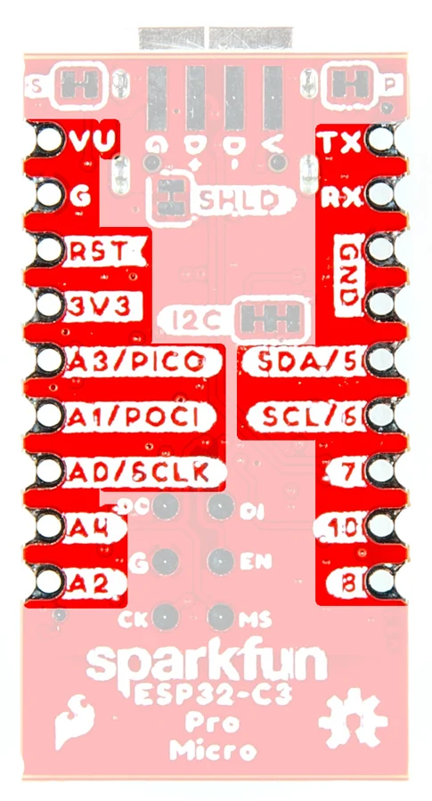

# Pro Micro - ESP32-C3

**SparkFun** · ESP32-C3

Revision: Not identified

Coverage: Physical pinout source collected; scope and revision require confirmation

[Browse all manufacturers](../../../../BROWSE.md) · [Devices & IoT](../../../../DEVICES.md) · [Open in the browser guide](https://valleytech-black-wire-guide.pages.dev/?board=sparkfun-pro-micro-esp32-c3)

Architecture: **RISC-V**

## Specifications and hardware documentation

- [Manufacturer hardware repository](https://github.com/sparkfun/SparkFun_Pro_Micro-ESP32C3)

## Manufacturer board pinout

**pinout image** · Reviewed source · JPG

[Open original reference](../../../../library/media/9eb74c181cbdda6cc4a300f33afc8e8dfd7a2ecbf8edf3912087a122d731d5b4.jpg)

**Credit and rights:** SparkFun / original diagram contributors. Rights not established for this asset; attribution retained. Original artwork is not covered by Black Wire's editorial license.. Source/manufacturer: SparkFun.

[Source 1](https://raw.githubusercontent.com/sparkfun/SparkFun_Pro_Micro-ESP32C3/b302fbc429a90b87865145877b96f189ad4d5460/docs/assets/img/23484-Pro-Micro-ESP32-C3-GPIO.jpg) · [Source 2](https://github.com/sparkfun/SparkFun_Pro_Micro-ESP32C3) · [Source 3](https://github.com/sparkfun/SparkFun_Pro_Micro-ESP32C3/tree/b302fbc429a90b87865145877b96f189ad4d5460)

Original publisher reference. Exact board/revision and electrical limits still require confirmation.

Image revision: Not identified

SHA-256: `9eb74c181cbdda6cc4a300f33afc8e8dfd7a2ecbf8edf3912087a122d731d5b4`

Pin assignments have not been independently electrically verified. Check board revision before wiring.
