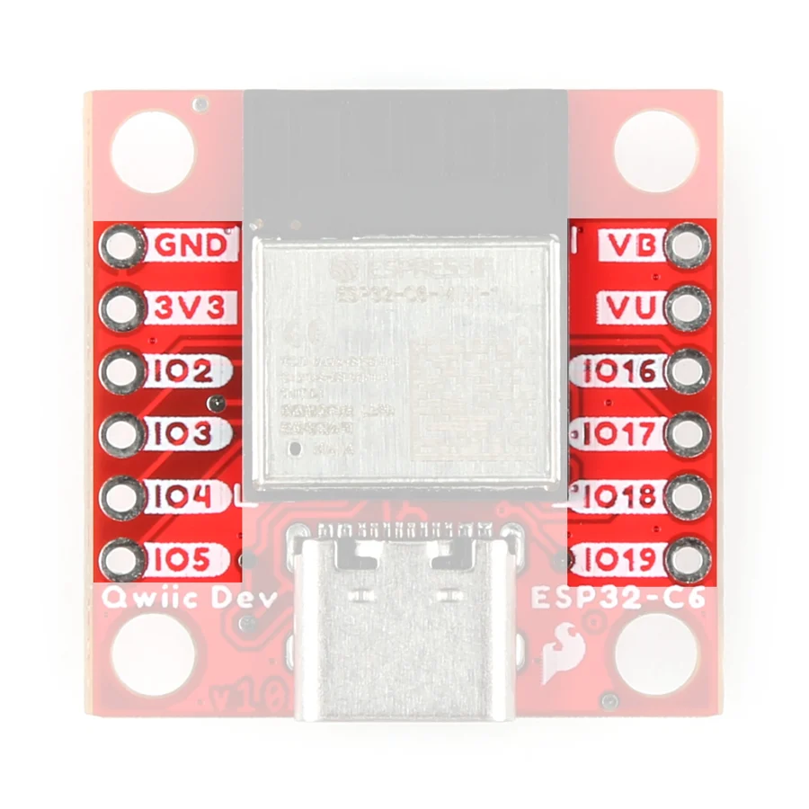
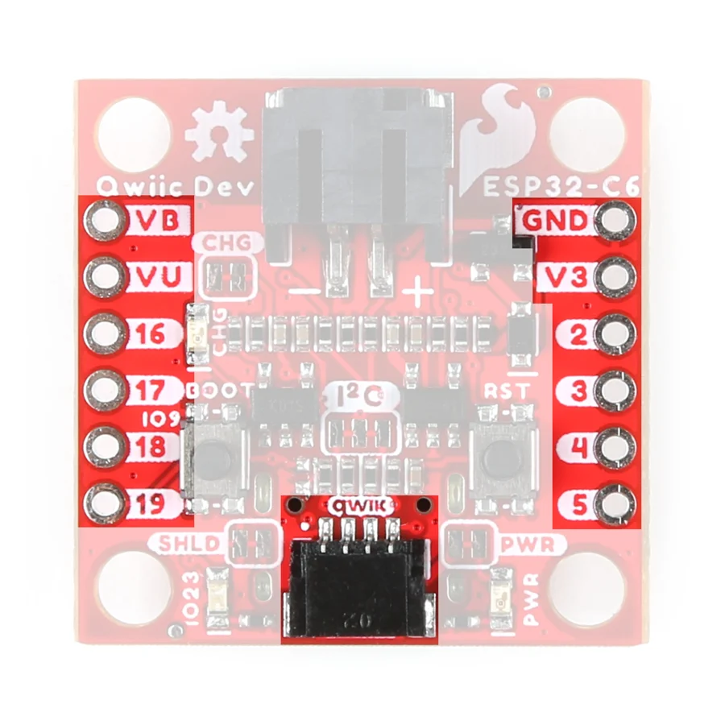

# Qwiic Pocket Development Board - ESP32-C6

**SparkFun** · ESP32-C6

Revision: Not identified

Coverage: Physical pinout source collected; scope and revision require confirmation

[Browse all manufacturers](../../../../BROWSE.md) · [Devices & IoT](../../../../DEVICES.md) · [Open in the browser guide](https://valleytech-black-wire-guide.pages.dev/?board=sparkfun-qwiic-pocket-development-board-esp32-c6)

Architecture: **RISC-V**

## Specifications and hardware documentation

- [Manufacturer hardware repository](https://github.com/sparkfun/SparkFun_Qwiic_Pocket_Dev_Board_ESP32_C6)

## Manufacturer board pinout

**pinout image** · Reviewed source · JPG

[Open original reference](../../../../library/media/6f99712e0b7bf2ea4edde48f09f411bdbc23cfc3e5187a1c837db1c28f978ee0.jpg)

**Credit and rights:** SparkFun / original diagram contributors. Rights not established for this asset; attribution retained. Original artwork is not covered by Black Wire's editorial license.. Source/manufacturer: SparkFun.

[Source 1](https://raw.githubusercontent.com/sparkfun/SparkFun_Qwiic_Pocket_Dev_Board_ESP32_C6/242b9740cadc2667aff62b3298838541b47ff371/docs/assets/images/Pocket_Dev_ESP32-Pinout.jpg) · [Source 2](https://github.com/sparkfun/SparkFun_Qwiic_Pocket_Dev_Board_ESP32_C6) · [Source 3](https://github.com/sparkfun/SparkFun_Qwiic_Pocket_Dev_Board_ESP32_C6/tree/242b9740cadc2667aff62b3298838541b47ff371)

Original publisher reference. Exact board/revision and electrical limits still require confirmation.

Image revision: Not identified

SHA-256: `6f99712e0b7bf2ea4edde48f09f411bdbc23cfc3e5187a1c837db1c28f978ee0`

## Manufacturer board pinout

**pinout image** · Reviewed source · JPG

[Open original reference](../../../../library/media/85faeb63c3cce9622fd50ef9eac96475132c342587d2e92a369cd5aa9337298b.jpg)

**Credit and rights:** SparkFun / original diagram contributors. Rights not established for this asset; attribution retained. Original artwork is not covered by Black Wire's editorial license.. Source/manufacturer: SparkFun.

[Source 1](https://raw.githubusercontent.com/sparkfun/SparkFun_Qwiic_Pocket_Dev_Board_ESP32_C6/242b9740cadc2667aff62b3298838541b47ff371/docs/assets/images/Pocket_Dev_ESP32-Qwiic_and_Pinout.jpg) · [Source 2](https://github.com/sparkfun/SparkFun_Qwiic_Pocket_Dev_Board_ESP32_C6) · [Source 3](https://github.com/sparkfun/SparkFun_Qwiic_Pocket_Dev_Board_ESP32_C6/tree/242b9740cadc2667aff62b3298838541b47ff371)

Original publisher reference. Exact board/revision and electrical limits still require confirmation.

Image revision: Not identified

SHA-256: `85faeb63c3cce9622fd50ef9eac96475132c342587d2e92a369cd5aa9337298b`

Pin assignments have not been independently electrically verified. Check board revision before wiring.
