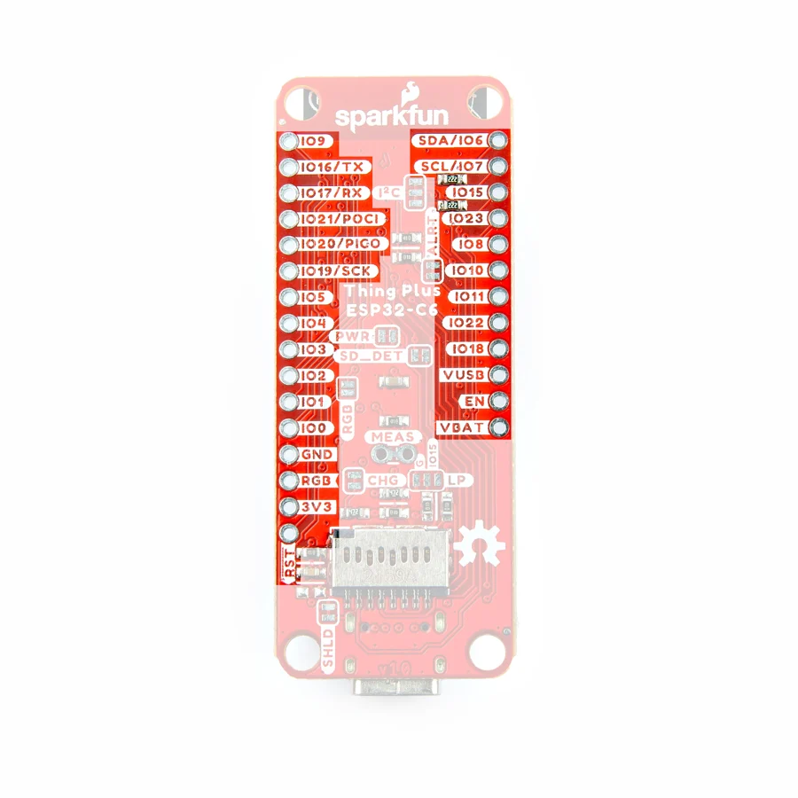

# Thing Plus ESP32-C6

**SparkFun** · ESP32-C6

Revision: Not identified

Coverage: Physical pinout source collected; scope and revision require confirmation

[Browse all manufacturers](../../../../BROWSE.md) · [Devices & IoT](../../../../DEVICES.md) · [Open in the browser guide](https://valleytech-black-wire-guide.pages.dev/?board=sparkfun-thing-plus-esp32-c6)

Architecture: **RISC-V**

## Specifications and hardware documentation

- [Specifications & hardware guide](https://docs.sparkfun.com/SparkFun_Thing_Plus_ESP32_C6/)

## Manufacturer board pinout

**pinout image** · Reviewed source · JPG

[Open original reference](../../../../library/media/af8722654eacf3d6bfc6d621df8b1eb23e9f281dfea3b413ce481a9efce4766e.jpg)

**Credit and rights:** SparkFun / original diagram contributors. Rights not established for this asset; attribution retained. Original artwork is not covered by Black Wire's editorial license.. Source/manufacturer: SparkFun.

[Source 1](https://raw.githubusercontent.com/sparkfun/SparkFun_Thing_Plus_ESP32_C6/fb7352f770b885fa9d5767bd25a168b90a11d4e5/docs/assets/img/Thing_Plus_C6-PTHs.jpg) · [Source 2](https://docs.sparkfun.com/SparkFun_Thing_Plus_ESP32_C6/) · [Source 3](https://github.com/sparkfun/SparkFun_Thing_Plus_ESP32_C6/tree/fb7352f770b885fa9d5767bd25a168b90a11d4e5)

Original publisher reference. Exact board/revision and electrical limits still require confirmation. Header mapping; verify full pin functions in the linked hardware guide.

Image revision: Not identified

SHA-256: `af8722654eacf3d6bfc6d621df8b1eb23e9f281dfea3b413ce481a9efce4766e`

Pin assignments have not been independently electrically verified. Check board revision before wiring.
