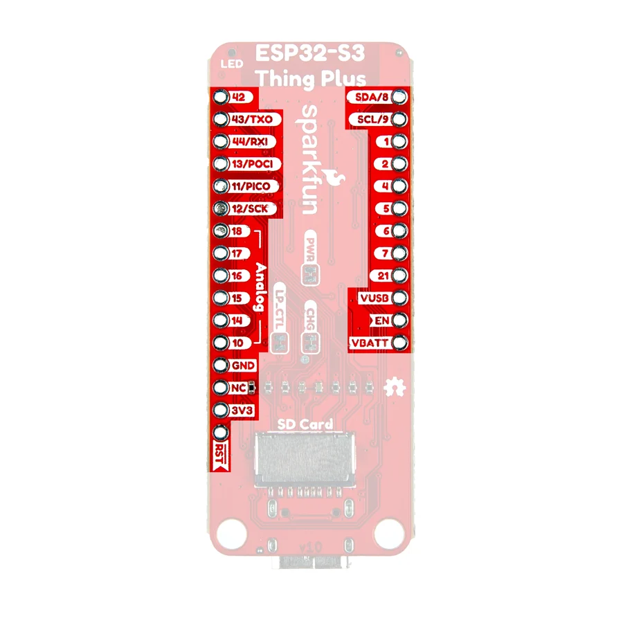
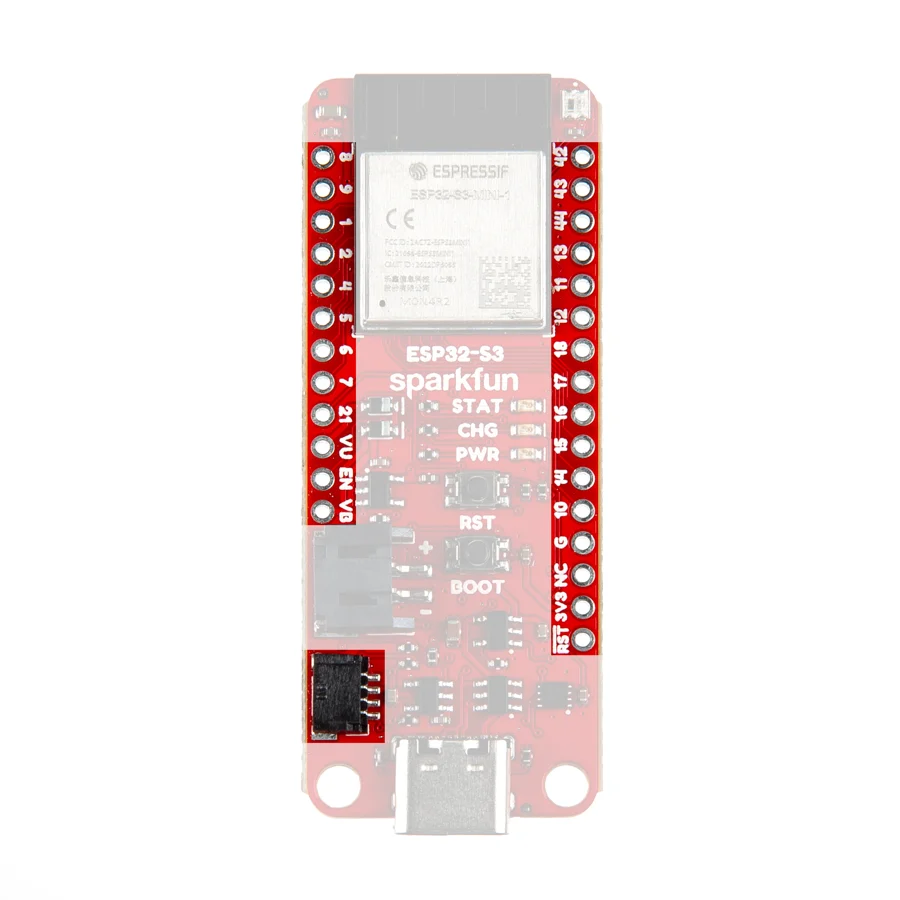

# Thing Plus ESP32-S3

**SparkFun** · ESP32-S3

Revision: Not identified

Coverage: Physical pinout source collected; scope and revision require confirmation

[Browse all manufacturers](../../../../BROWSE.md) · [Devices & IoT](../../../../DEVICES.md) · [Open in the browser guide](https://valleytech-black-wire-guide.pages.dev/?board=sparkfun-thing-plus-esp32-s3)

Architecture: **Xtensa**

## Specifications and hardware documentation

- [Specifications & hardware guide](https://docs.sparkfun.com/SparkFun_Thing_Plus_ESP32-S3/)

## Manufacturer board pinout

**pinout image** · Reviewed source · JPG

[Open original reference](../../../../library/media/608ad2a2ffcc75d056a49b28d183ecf52a38636b7d9f59b649cd6e40f80d1df6.jpg)

**Credit and rights:** SparkFun / original diagram contributors. Rights not established for this asset; attribution retained. Original artwork is not covered by Black Wire's editorial license.. Source/manufacturer: SparkFun.

[Source 1](https://raw.githubusercontent.com/sparkfun/SparkFun_Thing_Plus_ESP32-S3/c9fc69fc1d79e1f3e45f7f2e50d5e357b4dd9242/docs/assets/img/Thing_Plus_ESP32S3-PTHs.jpg) · [Source 2](https://docs.sparkfun.com/SparkFun_Thing_Plus_ESP32-S3/) · [Source 3](https://github.com/sparkfun/SparkFun_Thing_Plus_ESP32-S3/tree/c9fc69fc1d79e1f3e45f7f2e50d5e357b4dd9242)

Original publisher reference. Exact board/revision and electrical limits still require confirmation. Header mapping; verify full pin functions in the linked hardware guide.

Image revision: Not identified

SHA-256: `608ad2a2ffcc75d056a49b28d183ecf52a38636b7d9f59b649cd6e40f80d1df6`

## Manufacturer board pinout

**pinout image** · Reviewed source · JPG

[Open original reference](../../../../library/media/6a311b57543df4060ba1900b5840f78da14132d8c0e17e3323b42b4a6eaddf69.jpg)

**Credit and rights:** SparkFun / original diagram contributors. Rights not established for this asset; attribution retained. Original artwork is not covered by Black Wire's editorial license.. Source/manufacturer: SparkFun.

[Source 1](https://raw.githubusercontent.com/sparkfun/SparkFun_Thing_Plus_ESP32-S3/c9fc69fc1d79e1f3e45f7f2e50d5e357b4dd9242/docs/assets/img/Thing_Plus_ESP32S3-QwiicPTHs.jpg) · [Source 2](https://docs.sparkfun.com/SparkFun_Thing_Plus_ESP32-S3/) · [Source 3](https://github.com/sparkfun/SparkFun_Thing_Plus_ESP32-S3/tree/c9fc69fc1d79e1f3e45f7f2e50d5e357b4dd9242)

Original publisher reference. Exact board/revision and electrical limits still require confirmation. Header mapping; verify full pin functions in the linked hardware guide.

Image revision: Not identified

SHA-256: `6a311b57543df4060ba1900b5840f78da14132d8c0e17e3323b42b4a6eaddf69`

Pin assignments have not been independently electrically verified. Check board revision before wiring.
