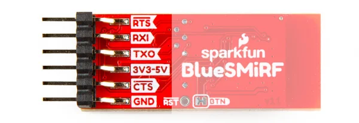
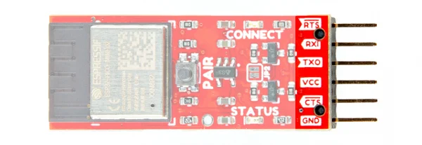
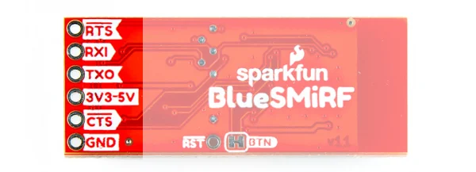
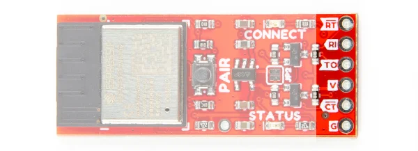

# BlueSMiRF v2

**SparkFun** · ESP32

Revision: Not identified

Coverage: Physical pinout source collected; scope and revision require confirmation

[Browse all manufacturers](../../../../BROWSE.md) · [Devices & IoT](../../../../DEVICES.md) · [Open in the browser guide](https://valleytech-black-wire-guide.pages.dev/?board=sparkfun-bluesmirf-v2)

Device category: **Controllers & instruments**

Architecture: **Xtensa**

## Specifications and hardware documentation

- [Manufacturer hardware repository](https://github.com/sparkfun/SparkFun_BlueSMiRF-v2)

## Manufacturer board pinout

**pinout image** · Reviewed source · JPG

[Open original reference](../../../../library/media/1720ff2f36f06bc57eda57b10e47017421b69882b79b3b7a6fc321884939147c.jpg)

**Credit and rights:** SparkFun / original diagram contributors. Rights not established for this asset; attribution retained. Original artwork is not covered by Black Wire's editorial license.. Source/manufacturer: SparkFun.

[Source 1](https://raw.githubusercontent.com/sparkfun/SparkFun_BlueSMiRF-v2/21329b716bf7cf05acca52f890d63939239e0961/docs/assets/img/headers-pinout_bottom.jpg) · [Source 2](https://github.com/sparkfun/SparkFun_BlueSMiRF-v2) · [Source 3](https://github.com/sparkfun/SparkFun_BlueSMiRF-v2/tree/21329b716bf7cf05acca52f890d63939239e0961)

Original publisher reference. Exact board/revision and electrical limits still require confirmation.

Image revision: Not identified

SHA-256: `1720ff2f36f06bc57eda57b10e47017421b69882b79b3b7a6fc321884939147c`

## Manufacturer board pinout

**pinout image** · Reviewed source · JPG

[Open original reference](../../../../library/media/76f63aa23b44405a3b11d7ab298fe23766dde837a0b9a7da7d8b7111ca9482c2.jpg)

**Credit and rights:** SparkFun / original diagram contributors. Rights not established for this asset; attribution retained. Original artwork is not covered by Black Wire's editorial license.. Source/manufacturer: SparkFun.

[Source 1](https://raw.githubusercontent.com/sparkfun/SparkFun_BlueSMiRF-v2/21329b716bf7cf05acca52f890d63939239e0961/docs/assets/img/headers-pinout_top.jpg) · [Source 2](https://github.com/sparkfun/SparkFun_BlueSMiRF-v2) · [Source 3](https://github.com/sparkfun/SparkFun_BlueSMiRF-v2/tree/21329b716bf7cf05acca52f890d63939239e0961)

Original publisher reference. Exact board/revision and electrical limits still require confirmation.

Image revision: Not identified

SHA-256: `76f63aa23b44405a3b11d7ab298fe23766dde837a0b9a7da7d8b7111ca9482c2`

## Manufacturer board pinout

**pinout image** · Reviewed source · JPG

[Open original reference](../../../../library/media/d90c3b0f3f02c7fb9c546df465c68451dd8a957887ded48d3ac901b09fc20326.jpg)

**Credit and rights:** SparkFun / original diagram contributors. Rights not established for this asset; attribution retained. Original artwork is not covered by Black Wire's editorial license.. Source/manufacturer: SparkFun.

[Source 1](https://raw.githubusercontent.com/sparkfun/SparkFun_BlueSMiRF-v2/21329b716bf7cf05acca52f890d63939239e0961/docs/assets/img/pth-pinout_bottom.jpg) · [Source 2](https://github.com/sparkfun/SparkFun_BlueSMiRF-v2) · [Source 3](https://github.com/sparkfun/SparkFun_BlueSMiRF-v2/tree/21329b716bf7cf05acca52f890d63939239e0961)

Original publisher reference. Exact board/revision and electrical limits still require confirmation.

Image revision: Not identified

SHA-256: `d90c3b0f3f02c7fb9c546df465c68451dd8a957887ded48d3ac901b09fc20326`

## Manufacturer board pinout

**pinout image** · Reviewed source · JPG

[Open original reference](../../../../library/media/6319b0d876c9c03a9dce127ca31875e61a5f7874a317cc31998a8c7ee562a66a.jpg)

**Credit and rights:** SparkFun / original diagram contributors. Rights not established for this asset; attribution retained. Original artwork is not covered by Black Wire's editorial license.. Source/manufacturer: SparkFun.

[Source 1](https://raw.githubusercontent.com/sparkfun/SparkFun_BlueSMiRF-v2/21329b716bf7cf05acca52f890d63939239e0961/docs/assets/img/pth-pinout_top.jpg) · [Source 2](https://github.com/sparkfun/SparkFun_BlueSMiRF-v2) · [Source 3](https://github.com/sparkfun/SparkFun_BlueSMiRF-v2/tree/21329b716bf7cf05acca52f890d63939239e0961)

Original publisher reference. Exact board/revision and electrical limits still require confirmation.

Image revision: Not identified

SHA-256: `6319b0d876c9c03a9dce127ca31875e61a5f7874a317cc31998a8c7ee562a66a`

Pin assignments have not been independently electrically verified. Check board revision before wiring.
