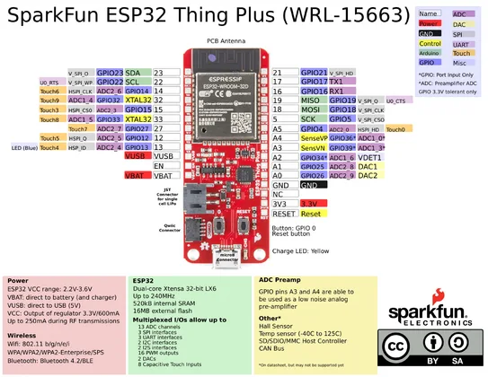

# ESP32 Thing Plus (micro-B)

**SparkFun** · ESP32

Revision: WRL-15663; PCB revision not identified

Coverage: Physical header pinout source available; independent completeness review pending

[Browse all manufacturers](../../../../BROWSE.md) · [Devices & IoT](../../../../DEVICES.md) · [Open in the browser guide](https://valleytech-black-wire-guide.pages.dev/?board=sparkfun-esp32-thing-plus-wrl-15663)

## Original manufacturer graphical pinout PDF

**original reference PDF** · Reviewed source · PDF

[Open original reference](../../../../library/media/8656a1d8020595976ac5e1c0f07022b61d116000dde67cca871156450a329db3.pdf)

**Credit and rights:** SparkFun Electronics; source sheet displays CC BY-SA (version not printed). Attribution and artwork retained; no broader rights claim.. Source/manufacturer: SparkFun.

[Source 1](https://cdn.sparkfun.com/assets/learn_tutorials/8/5/2/ESP32ThingPlusV20.pdf)

Exact WRL-15663 sheet. USB-C and micro-B versions have different GPIO mappings; do not interchange them. Source contains power-summary and alternate-function claims that still require independent review against the schematic and ESP32 datasheet. Physical header locations are visually identifiable; not an all-connector electrical approval.

Image revision: WRL-15663; PCB revision not identified

SHA-256: `8656a1d8020595976ac5e1c0f07022b61d116000dde67cca871156450a329db3`

## Physical header pinout — original PDF page 1

**pinout image** · Reviewed source · PNG

[Open original reference](../../../../library/media/e8ddc3081a52b1002c9bf1b77c694e1f80728aeec1cf16a0d584a81fb17c604e.png)

[Original vector companion](../../../../library/media/8656a1d8020595976ac5e1c0f07022b61d116000dde67cca871156450a329db3.pdf)

**Credit and rights:** SparkFun Electronics; source sheet displays CC BY-SA (version not printed). Attribution and artwork retained; no broader rights claim.. Source/manufacturer: SparkFun.

[Source 1](https://cdn.sparkfun.com/assets/learn_tutorials/8/5/2/ESP32ThingPlusV20.pdf)

Exact WRL-15663 sheet. USB-C and micro-B versions have different GPIO mappings; do not interchange them. Source contains power-summary and alternate-function claims that still require independent review against the schematic and ESP32 datasheet. Physical header locations are visually identifiable; not an all-connector electrical approval. This image is an unaltered page rendering of the retained original PDF; download the PDF for vector detail.

Image revision: WRL-15663; PCB revision not identified

SHA-256: `e8ddc3081a52b1002c9bf1b77c694e1f80728aeec1cf16a0d584a81fb17c604e`

Pin assignments have not been independently electrically verified. Check board revision before wiring.
