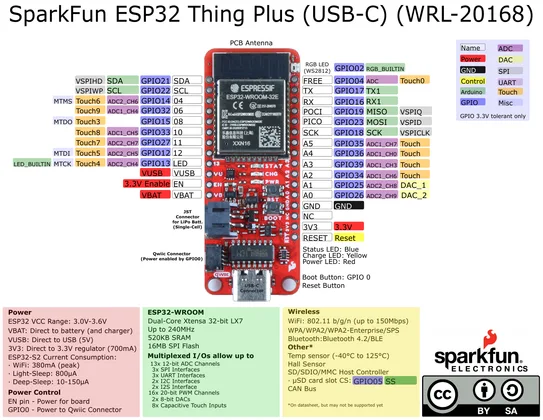

# ESP32 Thing Plus (USB-C)

**SparkFun** · ESP32

Revision: WRL-20168; PCB revision not identified

Coverage: Physical header pinout source available; independent completeness review pending

[Browse all manufacturers](../../../../BROWSE.md) · [Devices & IoT](../../../../DEVICES.md) · [Open in the browser guide](https://valleytech-black-wire-guide.pages.dev/?board=sparkfun-esp32-thing-plus-wrl-20168)

## Original manufacturer graphical pinout PDF

**original reference PDF** · Reviewed source · PDF

[Open original reference](../../../../library/media/f3e87c9682bd49d25cde4b9ae002fbf86a5309f90b2621052cf565c7876df565.pdf)

**Credit and rights:** SparkFun Electronics; source sheet displays CC BY-SA (version not printed). Attribution and artwork retained; no broader rights claim.. Source/manufacturer: SparkFun.

[Source 1](https://cdn.sparkfun.com/assets/3/9/5/f/e/SparkFun_Thing_Plus_ESP32_WROOM_C_graphical_datasheet2.pdf)

Exact WRL-20168 sheet. USB-C and micro-B versions have different GPIO mappings; do not interchange them. Source contains power-summary and alternate-function claims that still require independent review against the schematic and ESP32 datasheet. Physical header locations are visually identifiable; not an all-connector electrical approval.

Image revision: WRL-20168; PCB revision not identified

SHA-256: `f3e87c9682bd49d25cde4b9ae002fbf86a5309f90b2621052cf565c7876df565`

## Physical header pinout — original PDF page 1

**pinout image** · Reviewed source · PNG

[Open original reference](../../../../library/media/330805a7f50946a7c99616bf67b881c156ef7f246a7fdac85df75da721ac529c.png)

[Original vector companion](../../../../library/media/f3e87c9682bd49d25cde4b9ae002fbf86a5309f90b2621052cf565c7876df565.pdf)

**Credit and rights:** SparkFun Electronics; source sheet displays CC BY-SA (version not printed). Attribution and artwork retained; no broader rights claim.. Source/manufacturer: SparkFun.

[Source 1](https://cdn.sparkfun.com/assets/3/9/5/f/e/SparkFun_Thing_Plus_ESP32_WROOM_C_graphical_datasheet2.pdf)

Exact WRL-20168 sheet. USB-C and micro-B versions have different GPIO mappings; do not interchange them. Source contains power-summary and alternate-function claims that still require independent review against the schematic and ESP32 datasheet. Physical header locations are visually identifiable; not an all-connector electrical approval. This image is an unaltered page rendering of the retained original PDF; download the PDF for vector detail.

Image revision: WRL-20168; PCB revision not identified

SHA-256: `330805a7f50946a7c99616bf67b881c156ef7f246a7fdac85df75da721ac529c`

Pin assignments have not been independently electrically verified. Check board revision before wiring.
