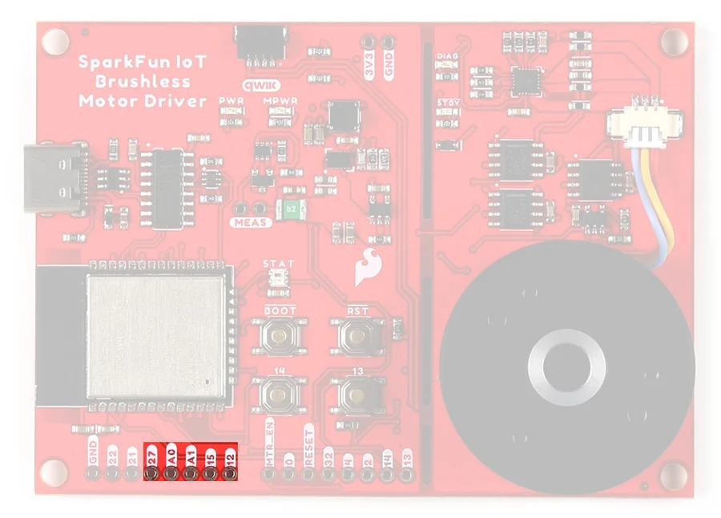
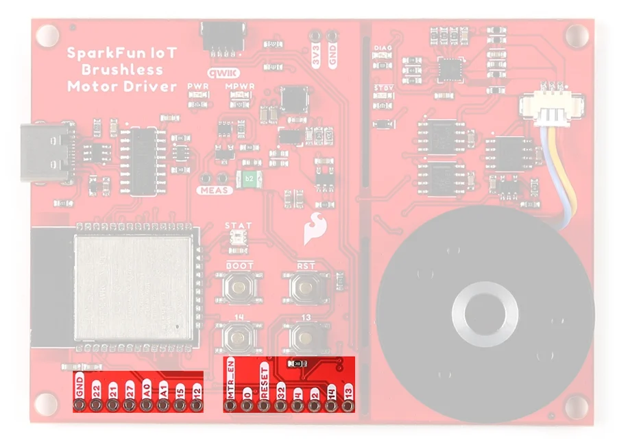

# IoT Brushless Motor Driver

**SparkFun** · ESP32

Revision: Not identified

Coverage: Physical pinout source collected; scope and revision require confirmation

[Browse all manufacturers](../../../../BROWSE.md) · [Devices & IoT](../../../../DEVICES.md) · [Open in the browser guide](https://valleytech-black-wire-guide.pages.dev/?board=sparkfun-iot-brushless-motor-driver)

Device category: **Controllers & instruments**

Architecture: **Xtensa**

## Specifications and hardware documentation

- [Manufacturer hardware repository](https://github.com/sparkfun/SparkFun_IoT_Brushless_Motor_Driver)

## Manufacturer board pinout

**pinout image** · Reviewed source · JPG

[Open original reference](../../../../library/media/632754b5cd99f38f138acc056f86199573a5dd676daa2cfea2e9ef478433d844.jpg)

**Credit and rights:** SparkFun / original diagram contributors. Rights not established for this asset; attribution retained. Original artwork is not covered by Black Wire's editorial license.. Source/manufacturer: SparkFun.

[Source 1](https://raw.githubusercontent.com/sparkfun/SparkFun_IoT_Brushless_Motor_Driver/dc769199c2106d3e00daf72636e0bca1ebe4baf3/docs/assets/img/hookup_guide/gpio-free.jpg) · [Source 2](https://github.com/sparkfun/SparkFun_IoT_Brushless_Motor_Driver) · [Source 3](https://github.com/sparkfun/SparkFun_IoT_Brushless_Motor_Driver/tree/dc769199c2106d3e00daf72636e0bca1ebe4baf3)

Original publisher reference. Exact board/revision and electrical limits still require confirmation. Map covers the highlighted connector group only.

Image revision: Not identified

SHA-256: `632754b5cd99f38f138acc056f86199573a5dd676daa2cfea2e9ef478433d844`

## Manufacturer board pinout

**pinout image** · Reviewed source · JPG

[Open original reference](../../../../library/media/38b639271dc575a03e140e83e26b7f4c920c3bd778296399dec3c9bdd29f4d31.jpg)

**Credit and rights:** SparkFun / original diagram contributors. Rights not established for this asset; attribution retained. Original artwork is not covered by Black Wire's editorial license.. Source/manufacturer: SparkFun.

[Source 1](https://raw.githubusercontent.com/sparkfun/SparkFun_IoT_Brushless_Motor_Driver/dc769199c2106d3e00daf72636e0bca1ebe4baf3/docs/assets/img/hookup_guide/gpio.jpg) · [Source 2](https://github.com/sparkfun/SparkFun_IoT_Brushless_Motor_Driver) · [Source 3](https://github.com/sparkfun/SparkFun_IoT_Brushless_Motor_Driver/tree/dc769199c2106d3e00daf72636e0bca1ebe4baf3)

Original publisher reference. Exact board/revision and electrical limits still require confirmation. Map covers the highlighted connector group only.

Image revision: Not identified

SHA-256: `38b639271dc575a03e140e83e26b7f4c920c3bd778296399dec3c9bdd29f4d31`

Pin assignments have not been independently electrically verified. Check board revision before wiring.
