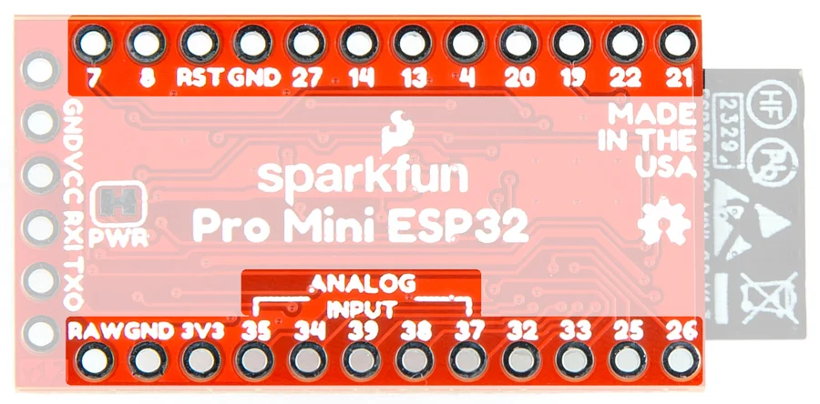

# Qwiic Pro Mini - ESP32

**SparkFun** · ESP32

Revision: Not identified

Coverage: Physical pinout source collected; scope and revision require confirmation

[Browse all manufacturers](../../../../BROWSE.md) · [Devices & IoT](../../../../DEVICES.md) · [Open in the browser guide](https://valleytech-black-wire-guide.pages.dev/?board=sparkfun-qwiic-pro-mini-esp32)

Architecture: **Xtensa**

## Specifications and hardware documentation

- [Manufacturer hardware repository](https://github.com/sparkfun/SparkFun_ESP32_Qwiic_Pro_Mini)

## Manufacturer board pinout

**pinout image** · Reviewed source · JPG

[Open original reference](../../../../library/media/dbf2337a2fada3d084287d8f7801064fbc5c16259f0827d9273c4d3d28d1ddec.jpg)

**Credit and rights:** SparkFun / original diagram contributors. Rights not established for this asset; attribution retained. Original artwork is not covered by Black Wire's editorial license.. Source/manufacturer: SparkFun.

[Source 1](https://raw.githubusercontent.com/sparkfun/SparkFun_ESP32_Qwiic_Pro_Mini/096c783fe9ea9842083e910e3605da65074924de/docs/assets/img/23386-Pro-Mini-ESP32-GPIO.jpg) · [Source 2](https://github.com/sparkfun/SparkFun_ESP32_Qwiic_Pro_Mini) · [Source 3](https://github.com/sparkfun/SparkFun_ESP32_Qwiic_Pro_Mini/tree/096c783fe9ea9842083e910e3605da65074924de)

Original publisher reference. Exact board/revision and electrical limits still require confirmation.

Image revision: Not identified

SHA-256: `dbf2337a2fada3d084287d8f7801064fbc5c16259f0827d9273c4d3d28d1ddec`

Pin assignments have not been independently electrically verified. Check board revision before wiring.
