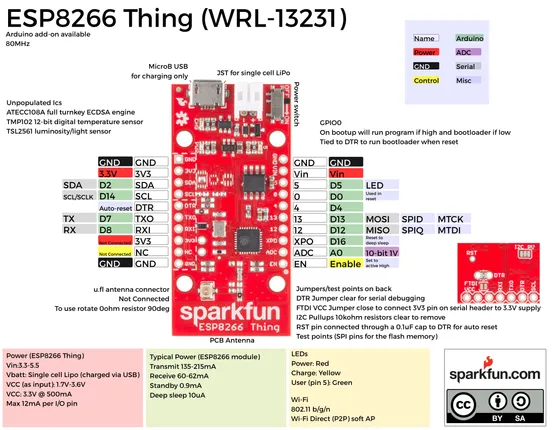

# ESP8266 Thing

**SparkFun** · ESP8266

Revision: Not identified  
Coverage: Pinout image collected

[Browse all manufacturers](../../../../BROWSE.md) · [Desktop app](https://github.com/valleytechsolutions/black-wire-desktop)

## Graphical board pinout reference

**pinout image** · Reviewed source · PNG

[Open original reference](../../../../library/media/c87c82260b0c688966669222b18380c6848be90114eb2075973643df96fbbec1.png)

**Credit and rights:** Not established; source attribution retained. Source/manufacturer: SparkFun.

[Source 1](https://cdn.sparkfun.com/datasheets/Wireless/WiFi/ESP8266ThingV1.pdf) · [Source 2](https://www.sparkfun.com/products/13231)

 Original PDF page 1 rendered at 220 dpi; no labels changed.

SHA-256: `c87c82260b0c688966669222b18380c6848be90114eb2075973643df96fbbec1`

## Original graphical pinout datasheet

**original reference PDF** · Reviewed source · PDF

[Open original reference](../../../../library/media/1565dae8a8e70af22a1155f2110272706cc72a0d3f8ff0630d0f956e9db546d5.pdf)

**Credit and rights:** Not established; source attribution retained. Source/manufacturer: SparkFun.

[Source 1](https://cdn.sparkfun.com/datasheets/Wireless/WiFi/ESP8266ThingV1.pdf) · [Source 2](https://www.sparkfun.com/products/13231)

SHA-256: `1565dae8a8e70af22a1155f2110272706cc72a0d3f8ff0630d0f956e9db546d5`

Pin assignments have not been independently electrically verified. Check board revision before wiring.
