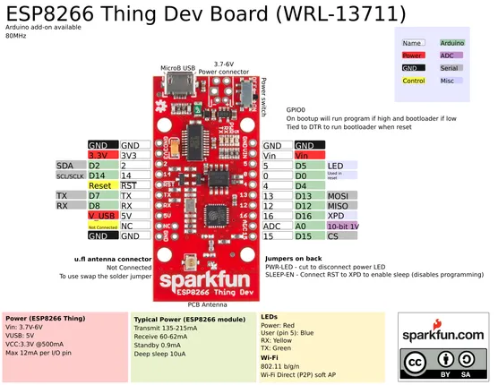

# ESP8266 Thing Dev

**SparkFun** · ESP8266

Revision: Not identified  
Coverage: Pinout image collected

[Browse all manufacturers](../../../../BROWSE.md) · [Desktop app](https://github.com/valleytechsolutions/black-wire-desktop)

## Graphical board pinout reference

**pinout image** · Reviewed source · PNG

[Open original reference](../../../../library/media/d28790284b1dd9de7899496bd3892304a7c632ba7407530b8b4a4a7c8894cb3b.png)

**Credit and rights:** Not established; source attribution retained. Source/manufacturer: SparkFun.

[Source 1](https://cdn.sparkfun.com/datasheets/Wireless/WiFi/ESP8266ThingDevV1.pdf) · [Source 2](https://www.sparkfun.com/products/13711)

 Original PDF page 1 rendered at 220 dpi; no labels changed.

SHA-256: `d28790284b1dd9de7899496bd3892304a7c632ba7407530b8b4a4a7c8894cb3b`

## Original graphical pinout datasheet

**original reference PDF** · Reviewed source · PDF

[Open original reference](../../../../library/media/3be6a5726359a3aca7e64b3c1872fe2af05f748df5074abad55a6a585589028d.pdf)

**Credit and rights:** Not established; source attribution retained. Source/manufacturer: SparkFun.

[Source 1](https://cdn.sparkfun.com/datasheets/Wireless/WiFi/ESP8266ThingDevV1.pdf) · [Source 2](https://www.sparkfun.com/products/13711)

SHA-256: `3be6a5726359a3aca7e64b3c1872fe2af05f748df5074abad55a6a585589028d`

Pin assignments have not been independently electrically verified. Check board revision before wiring.
