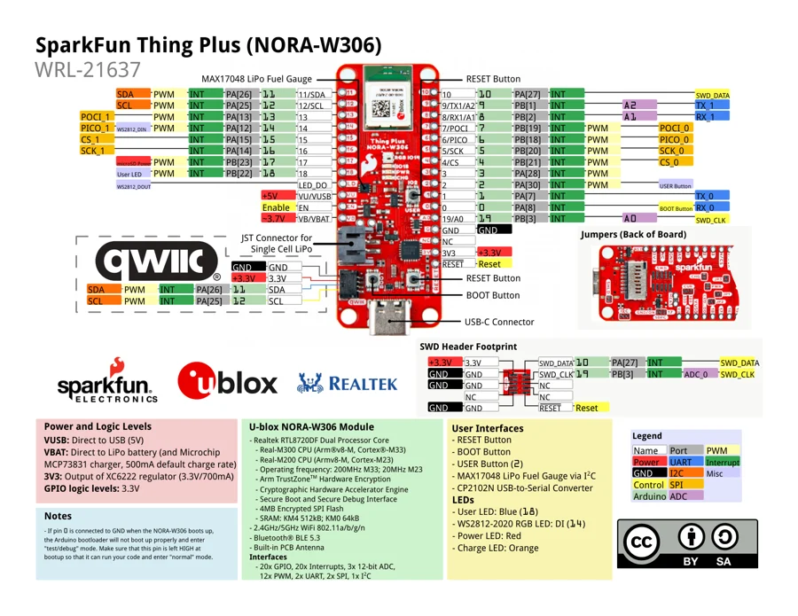

# Thing Plus NORA-W306

**SparkFun** · NORA-W306

Revision: Not identified

Coverage: Physical pinout source collected; scope and revision require confirmation

[Browse all manufacturers](../../../../BROWSE.md) · [Devices & IoT](../../../../DEVICES.md) · [Open in the browser guide](https://valleytech-black-wire-guide.pages.dev/?board=sparkfun-thing-plus-nora-w306)

## Specifications and hardware documentation

- [Specifications & hardware guide](https://www.sparkfun.com/products/21637)

## Original manufacturer graphical reference (PDF)

**original reference PDF** · Reviewed source · PDF

[Open original reference](../../../../library/media/4cd9324c85acb610c64c217ee6828c25435354f60fde3aff8ceb441fda43cb00.pdf)

**Credit and rights:** SparkFun Electronics / graphical datasheet contributors. CC BY-SA marking retained in the original; verify the applicable version in the source repository before redistribution.. Source/manufacturer: SparkFun.

[Source 1](https://raw.githubusercontent.com/sparkfun/Graphical_Datasheets/736369896be44fae46b1e04bd370dd88ef73a227/Datasheets/NORA-W306/SparkFun_Thing_Plus_NORA-W306_u-blox.pdf) · [Source 2](https://www.sparkfun.com/products/21637) · [Source 3](https://github.com/sparkfun/Graphical_Datasheets/tree/736369896be44fae46b1e04bd370dd88ef73a227)

Original publisher reference. Exact board/revision and electrical limits still require confirmation.

Image revision: Not identified

SHA-256: `4cd9324c85acb610c64c217ee6828c25435354f60fde3aff8ceb441fda43cb00`

## Manufacturer board pinout — page 1

**pinout image** · Reviewed source · PNG

[Open original reference](../../../../library/media/bd4b5a2a815b318931a5b51fbc3ce0a4ef3d0b90be55618e4ddf25e92fd50e5e.png)

**Credit and rights:** SparkFun Electronics / graphical datasheet contributors. CC BY-SA marking retained in the original; verify the applicable version in the source repository before redistribution.. Source/manufacturer: SparkFun.

[Source 1](https://raw.githubusercontent.com/sparkfun/Graphical_Datasheets/736369896be44fae46b1e04bd370dd88ef73a227/Datasheets/NORA-W306/SparkFun_Thing_Plus_NORA-W306_u-blox.pdf) · [Source 2](https://www.sparkfun.com/products/21637) · [Source 3](https://github.com/sparkfun/Graphical_Datasheets/tree/736369896be44fae46b1e04bd370dd88ef73a227)

Original publisher reference. Exact board/revision and electrical limits still require confirmation.  PDF page rendered at 144 dpi without changing labels. Original vector PDF retained.

Image revision: Not identified

SHA-256: `bd4b5a2a815b318931a5b51fbc3ce0a4ef3d0b90be55618e4ddf25e92fd50e5e`

Pin assignments have not been independently electrically verified. Check board revision before wiring.
