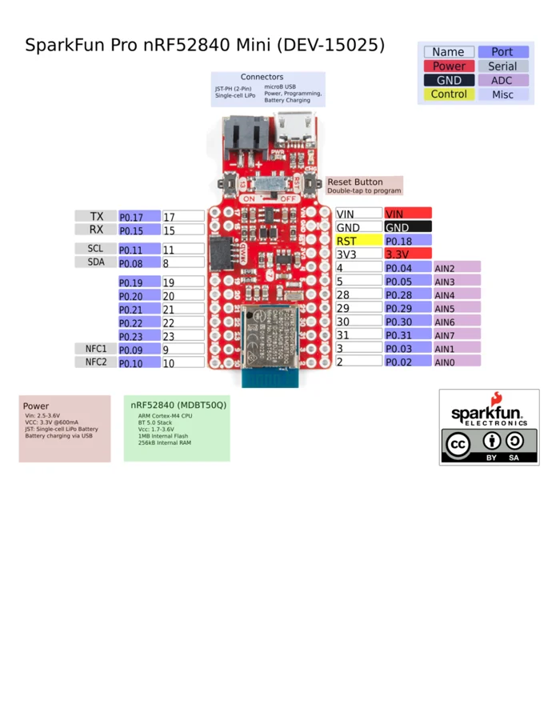

# Pro nRF52840 Mini

**SparkFun** · nRF52840

Revision: Not identified

Coverage: Physical pinout source collected; scope and revision require confirmation

[Browse all manufacturers](../../../../BROWSE.md) · [Devices & IoT](../../../../DEVICES.md) · [Open in the browser guide](https://valleytech-black-wire-guide.pages.dev/?board=sparkfun-pro-nrf52840-mini)

Architecture: **ARM**

## Specifications and hardware documentation

- [Specifications & hardware guide](https://www.sparkfun.com/products/15025)

## Original manufacturer graphical reference (PDF)

**original reference PDF** · Reviewed source · PDF

[Open original reference](../../../../library/media/ed742042ec3be3052ce5e96891e70f1182169836360f283e0339bb23f5a00a0e.pdf)

**Credit and rights:** SparkFun Electronics / graphical datasheet contributors. CC BY-SA marking retained in the original; verify the applicable version in the source repository before redistribution.. Source/manufacturer: SparkFun.

[Source 1](https://raw.githubusercontent.com/sparkfun/Graphical_Datasheets/736369896be44fae46b1e04bd370dd88ef73a227/Datasheets/nrf52840/Pro_nRF52840_Mini_Graphical_Datasheet.pdf) · [Source 2](https://www.sparkfun.com/products/15025) · [Source 3](https://github.com/sparkfun/Graphical_Datasheets/tree/736369896be44fae46b1e04bd370dd88ef73a227)

Original publisher reference. Exact board/revision and electrical limits still require confirmation.

Image revision: Not identified

SHA-256: `ed742042ec3be3052ce5e96891e70f1182169836360f283e0339bb23f5a00a0e`

## Manufacturer board pinout — page 1

**pinout image** · Reviewed source · PNG

[Open original reference](../../../../library/media/89e4a7cc9dfa93e16fdabe353e7c7da34ff42eaf2d4bc3c541e0ad3f00bd6a0c.png)

**Credit and rights:** SparkFun Electronics / graphical datasheet contributors. CC BY-SA marking retained in the original; verify the applicable version in the source repository before redistribution.. Source/manufacturer: SparkFun.

[Source 1](https://raw.githubusercontent.com/sparkfun/Graphical_Datasheets/736369896be44fae46b1e04bd370dd88ef73a227/Datasheets/nrf52840/Pro_nRF52840_Mini_Graphical_Datasheet.pdf) · [Source 2](https://www.sparkfun.com/products/15025) · [Source 3](https://github.com/sparkfun/Graphical_Datasheets/tree/736369896be44fae46b1e04bd370dd88ef73a227)

Original publisher reference. Exact board/revision and electrical limits still require confirmation.  PDF page rendered at 144 dpi without changing labels. Original vector PDF retained.

Image revision: Not identified

SHA-256: `89e4a7cc9dfa93e16fdabe353e7c7da34ff42eaf2d4bc3c541e0ad3f00bd6a0c`

Pin assignments have not been independently electrically verified. Check board revision before wiring.
