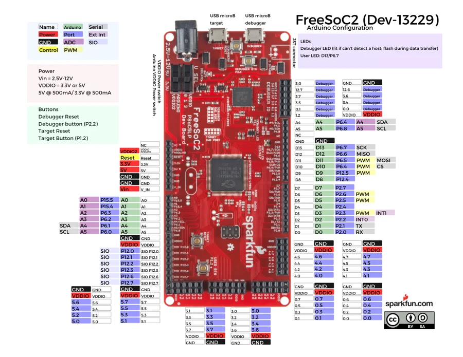

# FreeSoC2

**SparkFun** · PSoC 5LP

Revision: Not identified

Coverage: Physical pinout source collected; scope and revision require confirmation

[Browse all manufacturers](../../../../BROWSE.md) · [Devices & IoT](../../../../DEVICES.md) · [Open in the browser guide](https://valleytech-black-wire-guide.pages.dev/?board=sparkfun-freesoc2)

## Specifications and hardware documentation

- [Archived manufacturer hardware references](https://github.com/sparkfun/Graphical_Datasheets/tree/736369896be44fae46b1e04bd370dd88ef73a227/Datasheets/FreeSoC)

## Original manufacturer graphical reference (PDF)

**original reference PDF** · Reviewed source · PDF

[Open original reference](../../../../library/media/204b0602641ff056b066ffa79ef876052a91c76970cd0fb76a6ac9fba765e1f0.pdf)

**Credit and rights:** SparkFun Electronics / graphical datasheet contributors. CC BY-SA marking retained in the original; verify the applicable version in the source repository before redistribution.. Source/manufacturer: SparkFun.

[Source 1](https://raw.githubusercontent.com/sparkfun/Graphical_Datasheets/736369896be44fae46b1e04bd370dd88ef73a227/Datasheets/FreeSoC/FreeSocArduinov11.pdf) · [Source 2](https://www.sparkfun.com/products/13229) · [Source 3](https://github.com/sparkfun/Graphical_Datasheets/tree/736369896be44fae46b1e04bd370dd88ef73a227)

Original publisher reference. Exact board/revision and electrical limits still require confirmation.

Image revision: Not identified

SHA-256: `204b0602641ff056b066ffa79ef876052a91c76970cd0fb76a6ac9fba765e1f0`

## Manufacturer board pinout — page 1

**pinout image** · Reviewed source · PNG

[Open original reference](../../../../library/media/46f583fac280cebdc13d43c36315809f8c1cdd25999e336c42a95da2bb5274bc.png)

**Credit and rights:** SparkFun Electronics / graphical datasheet contributors. CC BY-SA marking retained in the original; verify the applicable version in the source repository before redistribution.. Source/manufacturer: SparkFun.

[Source 1](https://raw.githubusercontent.com/sparkfun/Graphical_Datasheets/736369896be44fae46b1e04bd370dd88ef73a227/Datasheets/FreeSoC/FreeSocArduinov11.pdf) · [Source 2](https://www.sparkfun.com/products/13229) · [Source 3](https://github.com/sparkfun/Graphical_Datasheets/tree/736369896be44fae46b1e04bd370dd88ef73a227)

Original publisher reference. Exact board/revision and electrical limits still require confirmation.  PDF page rendered at 144 dpi without changing labels. Original vector PDF retained.

Image revision: Not identified

SHA-256: `46f583fac280cebdc13d43c36315809f8c1cdd25999e336c42a95da2bb5274bc`

Pin assignments have not been independently electrically verified. Check board revision before wiring.
