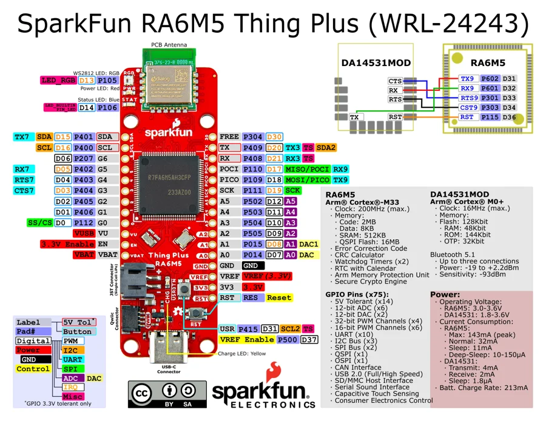
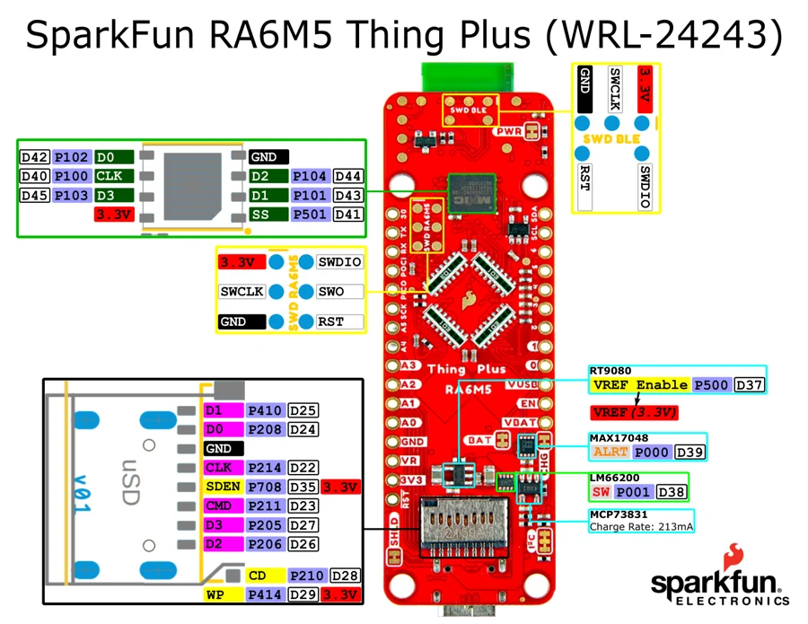

# Thing Plus RA6M5

**SparkFun** · RA6M5

Revision: Not identified

Coverage: Physical pinout source collected; scope and revision require confirmation

[Browse all manufacturers](../../../../BROWSE.md) · [Devices & IoT](../../../../DEVICES.md) · [Open in the browser guide](https://valleytech-black-wire-guide.pages.dev/?board=sparkfun-thing-plus-ra6m5)

## Specifications and hardware documentation

- [Specifications & hardware guide](https://www.sparkfun.com/products/24243)

## Original manufacturer graphical reference (PDF)

**original reference PDF** · Reviewed source · PDF

[Open original reference](../../../../library/media/319fd97445a03dd73a1e6c64dbef13bd4713847c47ce8f8ea1774cfd8bbf5a72.pdf)

**Credit and rights:** SparkFun Electronics / graphical datasheet contributors. CC BY-SA marking retained in the original; verify the applicable version in the source repository before redistribution.. Source/manufacturer: SparkFun.

[Source 1](https://raw.githubusercontent.com/sparkfun/Graphical_Datasheets/736369896be44fae46b1e04bd370dd88ef73a227/Datasheets/RA6M5/Thing%20Plus/graphical_datasheet.pdf) · [Source 2](https://www.sparkfun.com/products/24243) · [Source 3](https://github.com/sparkfun/Graphical_Datasheets/tree/736369896be44fae46b1e04bd370dd88ef73a227)

Original publisher reference. Exact board/revision and electrical limits still require confirmation.

Image revision: Not identified

SHA-256: `319fd97445a03dd73a1e6c64dbef13bd4713847c47ce8f8ea1774cfd8bbf5a72`

## Manufacturer board pinout — page 1

**pinout image** · Reviewed source · PNG

[Open original reference](../../../../library/media/37642c04c843939e1036f7ab3aea637b76002876341c2675df596a10465ec0ba.png)

**Credit and rights:** SparkFun Electronics / graphical datasheet contributors. CC BY-SA marking retained in the original; verify the applicable version in the source repository before redistribution.. Source/manufacturer: SparkFun.

[Source 1](https://raw.githubusercontent.com/sparkfun/Graphical_Datasheets/736369896be44fae46b1e04bd370dd88ef73a227/Datasheets/RA6M5/Thing%20Plus/graphical_datasheet.pdf) · [Source 2](https://www.sparkfun.com/products/24243) · [Source 3](https://github.com/sparkfun/Graphical_Datasheets/tree/736369896be44fae46b1e04bd370dd88ef73a227)

Original publisher reference. Exact board/revision and electrical limits still require confirmation.  PDF page rendered at 144 dpi without changing labels. Original vector PDF retained.

Image revision: Not identified

SHA-256: `37642c04c843939e1036f7ab3aea637b76002876341c2675df596a10465ec0ba`

## Manufacturer board pinout — page 2

**pinout image** · Reviewed source · PNG

[Open original reference](../../../../library/media/5a91c9db4728c16648735eca1cde410a5ac147703c08331e9453225fef15941e.png)

**Credit and rights:** SparkFun Electronics / graphical datasheet contributors. CC BY-SA marking retained in the original; verify the applicable version in the source repository before redistribution.. Source/manufacturer: SparkFun.

[Source 1](https://raw.githubusercontent.com/sparkfun/Graphical_Datasheets/736369896be44fae46b1e04bd370dd88ef73a227/Datasheets/RA6M5/Thing%20Plus/graphical_datasheet.pdf) · [Source 2](https://www.sparkfun.com/products/24243) · [Source 3](https://github.com/sparkfun/Graphical_Datasheets/tree/736369896be44fae46b1e04bd370dd88ef73a227)

Original publisher reference. Exact board/revision and electrical limits still require confirmation.  PDF page rendered at 144 dpi without changing labels. Original vector PDF retained.

Image revision: Not identified

SHA-256: `5a91c9db4728c16648735eca1cde410a5ac147703c08331e9453225fef15941e`

Pin assignments have not been independently electrically verified. Check board revision before wiring.
