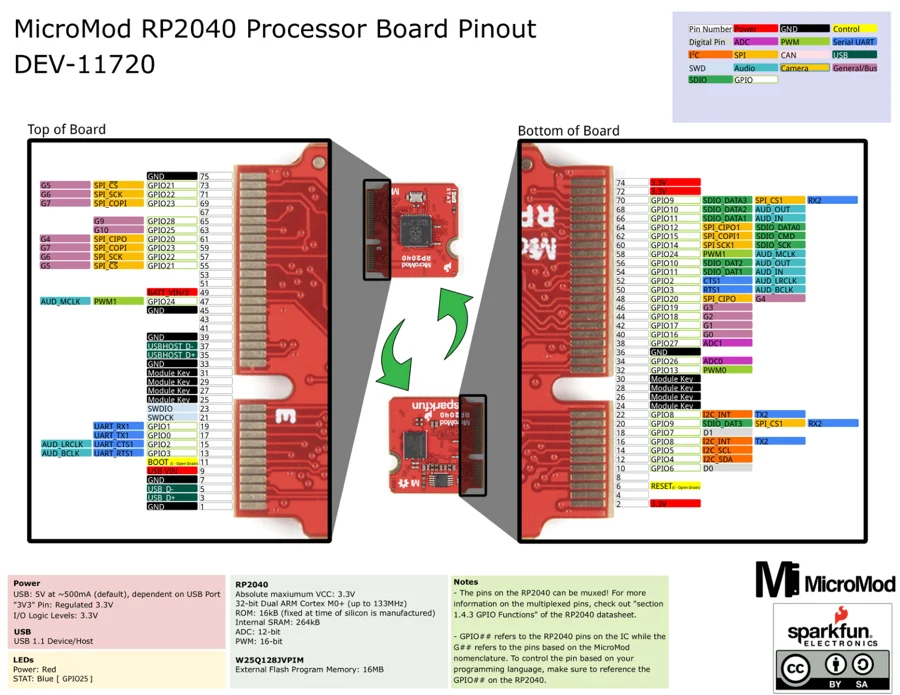

# MicroMod RP2040 Processor

**SparkFun** · RP2040

Revision: Not identified

Coverage: Physical pinout source collected; scope and revision require confirmation

[Browse all manufacturers](../../../../BROWSE.md) · [Devices & IoT](../../../../DEVICES.md) · [Open in the browser guide](https://valleytech-black-wire-guide.pages.dev/?board=sparkfun-rp2040-micromod-rp2040-processor)

Architecture: **ARM**

## Specifications and hardware documentation

- [Specifications & hardware guide](https://www.sparkfun.com/products/17720)

## Original manufacturer graphical reference (PDF)

**original reference PDF** · Reviewed source · PDF

[Open original reference](../../../../library/media/a7d13c39a34fea8e3d9f78d9bf8d4f744b06b19359431b3c131294f04e372980.pdf)

**Credit and rights:** SparkFun Electronics / graphical datasheet contributors. CC BY-SA marking retained in the original; verify the applicable version in the source repository before redistribution.. Source/manufacturer: SparkFun.

[Source 1](https://raw.githubusercontent.com/sparkfun/Graphical_Datasheets/736369896be44fae46b1e04bd370dd88ef73a227/Datasheets/RP2040/MicroMod%20General%20Pinout%20v10%20Graphical%20Datasheet.pdf) · [Source 2](https://www.sparkfun.com/products/17720) · [Source 3](https://circuitpython.org/board/sparkfun_micromod_rp2040/) · [Source 4](https://github.com/sparkfun/Graphical_Datasheets/tree/736369896be44fae46b1e04bd370dd88ef73a227)

Original publisher reference. Exact board/revision and electrical limits still require confirmation.

Image revision: Not identified

SHA-256: `a7d13c39a34fea8e3d9f78d9bf8d4f744b06b19359431b3c131294f04e372980`

## Manufacturer board pinout — page 1

**pinout image** · Reviewed source · PNG

[Open original reference](../../../../library/media/2a6ec51903e95792330194420beac48fdc89b9fabef9c05bf6aa018df6e4554c.png)

**Credit and rights:** SparkFun Electronics / graphical datasheet contributors. CC BY-SA marking retained in the original; verify the applicable version in the source repository before redistribution.. Source/manufacturer: SparkFun.

[Source 1](https://raw.githubusercontent.com/sparkfun/Graphical_Datasheets/736369896be44fae46b1e04bd370dd88ef73a227/Datasheets/RP2040/MicroMod%20General%20Pinout%20v10%20Graphical%20Datasheet.pdf) · [Source 2](https://www.sparkfun.com/products/17720) · [Source 3](https://circuitpython.org/board/sparkfun_micromod_rp2040/) · [Source 4](https://github.com/sparkfun/Graphical_Datasheets/tree/736369896be44fae46b1e04bd370dd88ef73a227)

Original publisher reference. Exact board/revision and electrical limits still require confirmation.  PDF page rendered at 144 dpi without changing labels. Original vector PDF retained.

Image revision: Not identified

SHA-256: `2a6ec51903e95792330194420beac48fdc89b9fabef9c05bf6aa018df6e4554c`

Pin assignments have not been independently electrically verified. Check board revision before wiring.
