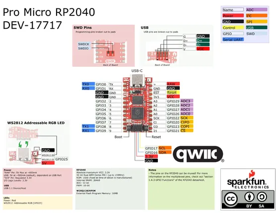

# Pro Micro RP2040

**SparkFun** · RP2040

Revision: Diagram DEV-17717  
Coverage: Pinout image collected

[Browse all manufacturers](../../../../BROWSE.md) · [Desktop app](https://github.com/valleytechsolutions/black-wire-desktop)

## Pinout reference - PDF page 1

**pinout image** · Reviewed source · PNG

[Open original reference](../../../../library/media/be82298dc716659585f61a26af169f09967d9304e87a472f0be7cb6bd1228c33.png)

**Credit and rights:** Not established; source attribution retained. Source/manufacturer: SparkFun.

[Source 1](https://cdn.sparkfun.com/assets/e/2/7/6/b/ProMicroRP2040_Graphical_Datasheet.pdf) · [Source 2](https://www.sparkfun.com/sparkfun-pro-micro-rp2040.html)

Manufacturer product page DEV-18288 links the DEV-17717 graphical datasheet and says the newer board is functionally identical with component-layout changes. Reference image shows DEV-17717.

SHA-256: `be82298dc716659585f61a26af169f09967d9304e87a472f0be7cb6bd1228c33`

## Manufacturer pinout reference

**original reference PDF** · Reviewed source · PDF

[Open original reference](../../../../library/media/7e7379b4a5b7ec8ff561a642390932efaa55c3e494a9ddce754382646278cd78.pdf)

**Credit and rights:** Not established; source attribution retained. Source/manufacturer: SparkFun.

[Source 1](https://cdn.sparkfun.com/assets/e/2/7/6/b/ProMicroRP2040_Graphical_Datasheet.pdf) · [Source 2](https://www.sparkfun.com/sparkfun-pro-micro-rp2040.html)

Manufacturer product page DEV-18288 links the DEV-17717 graphical datasheet and says the newer board is functionally identical with component-layout changes. Reference image shows DEV-17717.

SHA-256: `7e7379b4a5b7ec8ff561a642390932efaa55c3e494a9ddce754382646278cd78`

Pin assignments have not been independently electrically verified. Check board revision before wiring.
