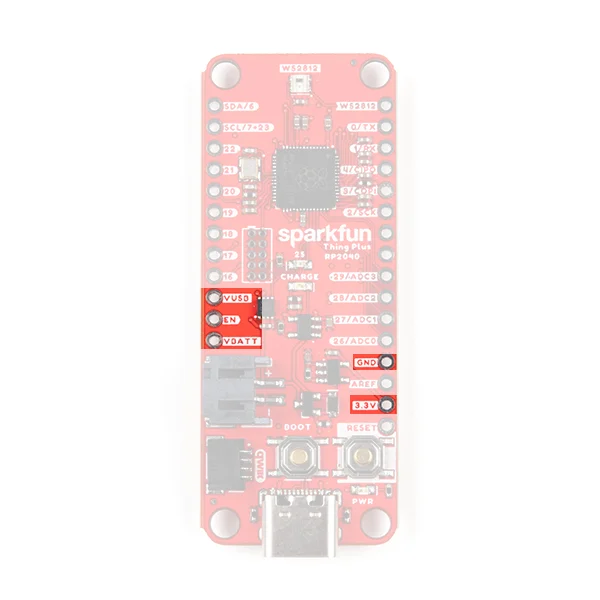
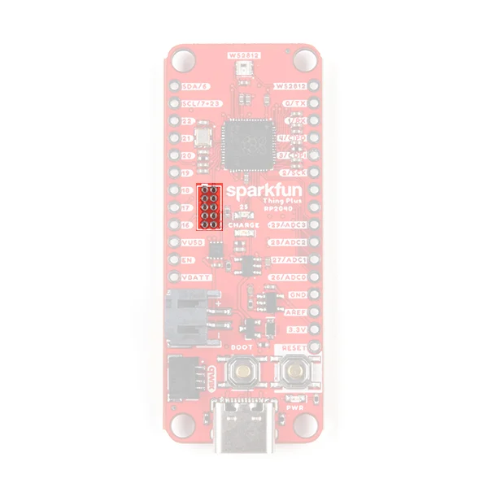
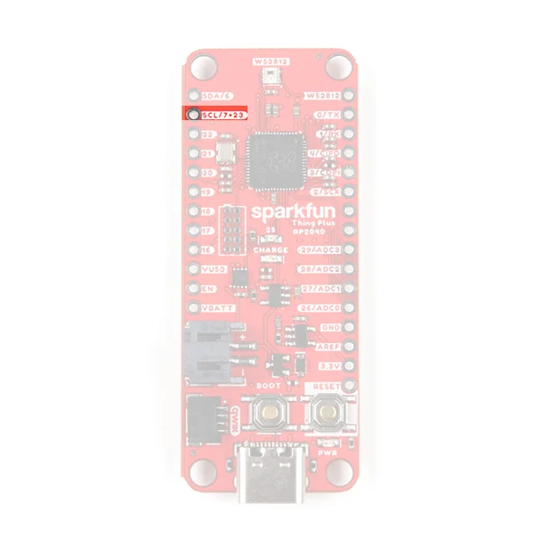

# Thing Plus - RP2040

**SparkFun** · RP2040

Revision: Not identified

Coverage: Supporting reference collected; physical pinout still needed

[Browse all manufacturers](../../../../BROWSE.md) · [Devices & IoT](../../../../DEVICES.md) · [Open in the browser guide](https://valleytech-black-wire-guide.pages.dev/?board=sparkfun-rp2040-thing-plus-rp2040)

Architecture: **ARM**

## Specifications and hardware documentation

- [Specifications & hardware guide](https://learn.sparkfun.com/tutorials/rp2040-thing-plus-hookup-guide/all)

## Power header labels

**GPIO reference image** · Reviewed source · JPEG

[Open original reference](../../../../library/media/1d42ae445c1830d61d53125a3806669c4e0775f3007545f4aa3d51fbb65dfa77.jpeg)

**Credit and rights:** SparkFun / original diagram contributors. Rights not established for this asset; attribution retained. Original artwork is not covered by Black Wire's editorial license.. Source/manufacturer: SparkFun.

[Source 1](https://cdn.sparkfun.com/assets/learn_tutorials/1/5/2/7/RP2040_Thing_Plus_power_pins_2.jpeg) · [Source 2](https://learn.sparkfun.com/tutorials/rp2040-thing-plus-hookup-guide/all) · [Source 3](https://www.sparkfun.com/products/17745) · [Source 4](https://circuitpython.org/board/sparkfun_thing_plus_rp2040/)

Original publisher reference. Exact board/revision and electrical limits still require confirmation. Highlighted subset only; this is not a complete board signal map.

Image revision: Not identified

SHA-256: `1d42ae445c1830d61d53125a3806669c4e0775f3007545f4aa3d51fbb65dfa77`

## Debug connector location

**GPIO reference image** · Reviewed source · JPEG

[Open original reference](../../../../library/media/c113b420b2aea6f19b18378654d0ba72bbb8ca142052b2bc3304295dc2a2214c.jpeg)

**Credit and rights:** SparkFun / original diagram contributors. Rights not established for this asset; attribution retained. Original artwork is not covered by Black Wire's editorial license.. Source/manufacturer: SparkFun.

[Source 1](https://cdn.sparkfun.com/assets/learn_tutorials/1/5/2/7/RP2040_Thing_Plus_JTAG.jpeg) · [Source 2](https://learn.sparkfun.com/tutorials/rp2040-thing-plus-hookup-guide/all) · [Source 3](https://www.sparkfun.com/products/17745) · [Source 4](https://circuitpython.org/board/sparkfun_thing_plus_rp2040/)

Original publisher reference. Exact board/revision and electrical limits still require confirmation. Highlighted subset only; this is not a complete board signal map.

Image revision: Not identified

SHA-256: `c113b420b2aea6f19b18378654d0ba72bbb8ca142052b2bc3304295dc2a2214c`

## Shared GPIO 7 / 23 pad

**GPIO reference image** · Reviewed source · JPEG

[Open original reference](../../../../library/media/7bfabc481725552107eb84046cc8285265d76e5f0a2b139f02526b6de84344f7.jpeg)

**Credit and rights:** SparkFun / original diagram contributors. Rights not established for this asset; attribution retained. Original artwork is not covered by Black Wire's editorial license.. Source/manufacturer: SparkFun.

[Source 1](https://cdn.sparkfun.com/assets/learn_tutorials/1/5/2/7/RP2040_Thing_Plus_shared_GPIO.jpeg) · [Source 2](https://learn.sparkfun.com/tutorials/rp2040-thing-plus-hookup-guide/all) · [Source 3](https://www.sparkfun.com/products/17745) · [Source 4](https://circuitpython.org/board/sparkfun_thing_plus_rp2040/)

Original publisher reference. Exact board/revision and electrical limits still require confirmation. Highlighted subset only; this is not a complete board signal map.

Image revision: Not identified

SHA-256: `7bfabc481725552107eb84046cc8285265d76e5f0a2b139f02526b6de84344f7`

Pin assignments have not been independently electrically verified. Check board revision before wiring.
