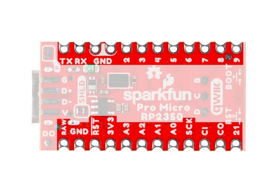

# Pro Micro - RP2350

**SparkFun** · RP2350

Revision: Not identified

Coverage: Supporting header-label reference; complete physical pinout still needed

[Browse all manufacturers](../../../../BROWSE.md) · [Devices & IoT](../../../../DEVICES.md) · [Open in the browser guide](https://valleytech-black-wire-guide.pages.dev/?board=sparkfun-rp2350-pro-micro-rp2350)

## Manufacturer header-label reference (supporting)

**board labeling image** · Reviewed source · JPG

[Open original reference](../../../../library/media/43878931ca440d617c374dcc3187082ece1ba65f9213961bff492bb6bf84428b.jpg)

**Credit and rights:** SparkFun Electronics; artwork rights not established; source attribution retained. Source/manufacturer: SparkFun.

[Source 1](https://docs.sparkfun.com/SparkFun_Pro_Micro_RP2350/assets/img/Pro_Micro_RP2350-GPIO_Back.jpg) · [Source 2](https://docs.sparkfun.com/SparkFun_Pro_Micro_RP2350/hardware_overview/)

Back-side header silkscreen labels only. This supporting photo does not explain every GPIO alternate function or all exposed pads.

Image revision: Not identified

SHA-256: `43878931ca440d617c374dcc3187082ece1ba65f9213961bff492bb6bf84428b`

Pin assignments have not been independently electrically verified. Check board revision before wiring.
