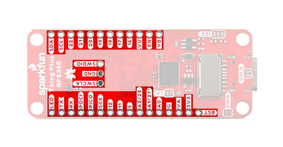

# Thing Plus - RP2350

**SparkFun** · RP2350

Revision: Not identified

Coverage: Supporting header-label reference; complete physical pinout still needed

[Browse all manufacturers](../../../../BROWSE.md) · [Devices & IoT](../../../../DEVICES.md) · [Open in the browser guide](https://valleytech-black-wire-guide.pages.dev/?board=sparkfun-rp2350-thing-plus-rp2350)

## Manufacturer header-label reference (supporting)

**board labeling image** · Reviewed source · JPG

[Open original reference](../../../../library/media/25f573a4e98ecd5170ea0e7e7e4531fbd2eec1b717d58bae605ff6146d44dd5f.jpg)

**Credit and rights:** SparkFun Electronics; artwork rights not established; source attribution retained. Source/manufacturer: SparkFun.

[Source 1](https://docs.sparkfun.com/SparkFun_Thing_Plus_RP2350/assets/img/Thing_Plus_RP2350-Pinout.jpg) · [Source 2](https://docs.sparkfun.com/SparkFun_Thing_Plus_RP2350/hardware_overview/)

Header silkscreen labels only; alternate GPIO functions and complete connector mapping remain to be collected. Manufacturer notes v10 (DD-27675) has reversed battery polarity compared with v11 (WRL-25134); inspect the physical board silkscreen before attaching a battery.

Image revision: Not identified

SHA-256: `25f573a4e98ecd5170ea0e7e7e4531fbd2eec1b717d58bae605ff6146d44dd5f`

Pin assignments have not been independently electrically verified. Check board revision before wiring.
