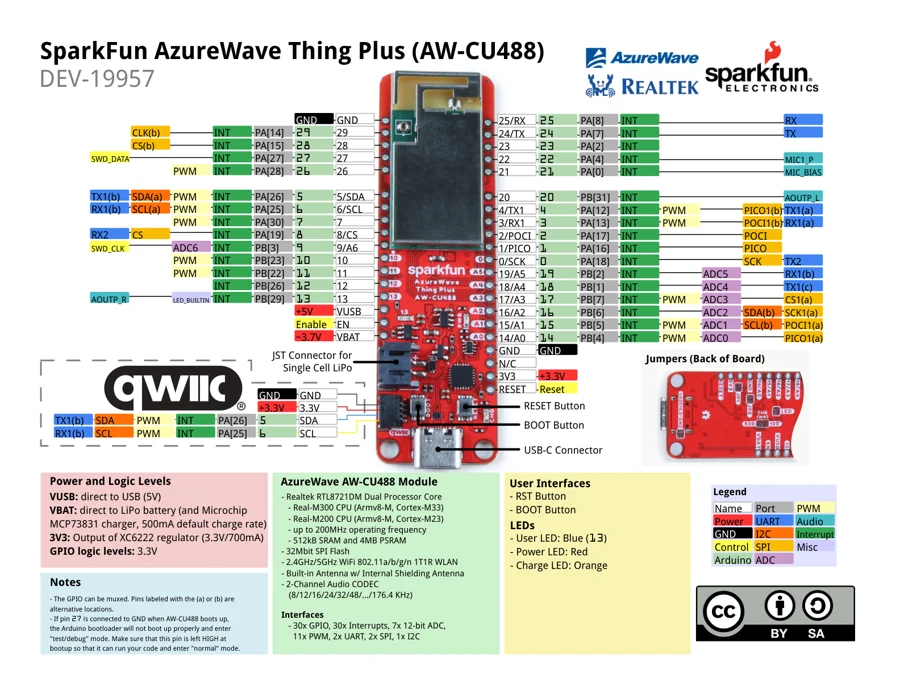

# AzureWave Thing Plus AW-CU488

**SparkFun** · RTL8721DM

Revision: Not identified

Coverage: Physical pinout source collected; scope and revision require confirmation

[Browse all manufacturers](../../../../BROWSE.md) · [Devices & IoT](../../../../DEVICES.md) · [Open in the browser guide](https://valleytech-black-wire-guide.pages.dev/?board=sparkfun-azurewave-thing-plus-aw-cu488)

## Specifications and hardware documentation

- [Specifications & hardware guide](https://www.sparkfun.com/products/19957)

## Original manufacturer graphical reference (PDF)

**original reference PDF** · Reviewed source · PDF

[Open original reference](../../../../library/media/ad0f6db7dc7204c03f388fbcb448903d5d50fddeeddce65faf6f1514e46658bd.pdf)

**Credit and rights:** SparkFun Electronics / graphical datasheet contributors. CC BY-SA marking retained in the original; verify the applicable version in the source repository before redistribution.. Source/manufacturer: SparkFun.

[Source 1](https://raw.githubusercontent.com/sparkfun/Graphical_Datasheets/736369896be44fae46b1e04bd370dd88ef73a227/Datasheets/AW-CU488/SparkFun_AzureWave_Thing_Plus-AW-CU488_v10b.pdf) · [Source 2](https://www.sparkfun.com/products/19957) · [Source 3](https://github.com/sparkfun/Graphical_Datasheets/tree/736369896be44fae46b1e04bd370dd88ef73a227)

Original publisher reference. Exact board/revision and electrical limits still require confirmation.

Image revision: Not identified

SHA-256: `ad0f6db7dc7204c03f388fbcb448903d5d50fddeeddce65faf6f1514e46658bd`

## Manufacturer board pinout — page 1

**pinout image** · Reviewed source · PNG

[Open original reference](../../../../library/media/3e00a160556d9cb6cd2a0260cd774b1b71012aba754333c710bf6db9618c0af1.png)

**Credit and rights:** SparkFun Electronics / graphical datasheet contributors. CC BY-SA marking retained in the original; verify the applicable version in the source repository before redistribution.. Source/manufacturer: SparkFun.

[Source 1](https://raw.githubusercontent.com/sparkfun/Graphical_Datasheets/736369896be44fae46b1e04bd370dd88ef73a227/Datasheets/AW-CU488/SparkFun_AzureWave_Thing_Plus-AW-CU488_v10b.pdf) · [Source 2](https://www.sparkfun.com/products/19957) · [Source 3](https://github.com/sparkfun/Graphical_Datasheets/tree/736369896be44fae46b1e04bd370dd88ef73a227)

Original publisher reference. Exact board/revision and electrical limits still require confirmation.  PDF page rendered at 144 dpi without changing labels. Original vector PDF retained.

Image revision: Not identified

SHA-256: `3e00a160556d9cb6cd2a0260cd774b1b71012aba754333c710bf6db9618c0af1`

Pin assignments have not been independently electrically verified. Check board revision before wiring.
