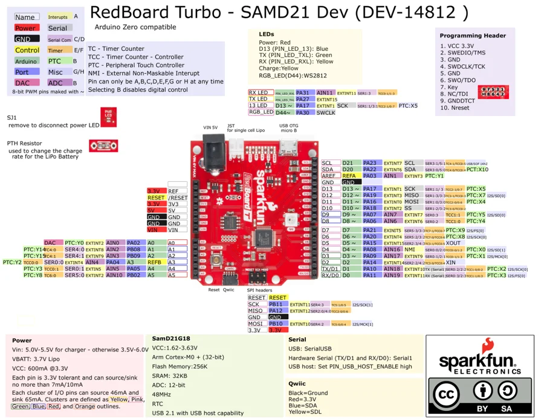

# RedBoard Turbo

**SparkFun** · SAMD21

Revision: Not identified

Coverage: Physical pinout source collected; scope and revision require confirmation

[Browse all manufacturers](../../../../BROWSE.md) · [Devices & IoT](../../../../DEVICES.md) · [Open in the browser guide](https://valleytech-black-wire-guide.pages.dev/?board=sparkfun-redboard-turbo)

Architecture: **ARM**

## Specifications and hardware documentation

- [Specifications & hardware guide](https://www.sparkfun.com/products/14812)

## Original manufacturer graphical reference (PDF)

**original reference PDF** · Reviewed source · PDF

[Open original reference](../../../../library/media/7accfa49f68cf82336d9450bff6953ce611d40a02487affc1231f722b8b1a508.pdf)

**Credit and rights:** SparkFun Electronics / graphical datasheet contributors. CC BY-SA marking retained in the original; verify the applicable version in the source repository before redistribution.. Source/manufacturer: SparkFun.

[Source 1](https://raw.githubusercontent.com/sparkfun/Graphical_Datasheets/736369896be44fae46b1e04bd370dd88ef73a227/Datasheets/SAM21/GraphicalDatasheet-SAMD21TurboDev_1.pdf) · [Source 2](https://www.sparkfun.com/products/14812) · [Source 3](https://github.com/sparkfun/Graphical_Datasheets/tree/736369896be44fae46b1e04bd370dd88ef73a227)

Original publisher reference. Exact board/revision and electrical limits still require confirmation.

Image revision: Not identified

SHA-256: `7accfa49f68cf82336d9450bff6953ce611d40a02487affc1231f722b8b1a508`

## Manufacturer board pinout — page 1

**pinout image** · Reviewed source · PNG

[Open original reference](../../../../library/media/f875a6f3aa1f5d76cd948bcf78aaf24f87e5be596057ef30ef51a3f7a8efc93a.png)

**Credit and rights:** SparkFun Electronics / graphical datasheet contributors. CC BY-SA marking retained in the original; verify the applicable version in the source repository before redistribution.. Source/manufacturer: SparkFun.

[Source 1](https://raw.githubusercontent.com/sparkfun/Graphical_Datasheets/736369896be44fae46b1e04bd370dd88ef73a227/Datasheets/SAM21/GraphicalDatasheet-SAMD21TurboDev_1.pdf) · [Source 2](https://www.sparkfun.com/products/14812) · [Source 3](https://github.com/sparkfun/Graphical_Datasheets/tree/736369896be44fae46b1e04bd370dd88ef73a227)

Original publisher reference. Exact board/revision and electrical limits still require confirmation.  PDF page rendered at 144 dpi without changing labels. Original vector PDF retained.

Image revision: Not identified

SHA-256: `f875a6f3aa1f5d76cd948bcf78aaf24f87e5be596057ef30ef51a3f7a8efc93a`

Pin assignments have not been independently electrically verified. Check board revision before wiring.
