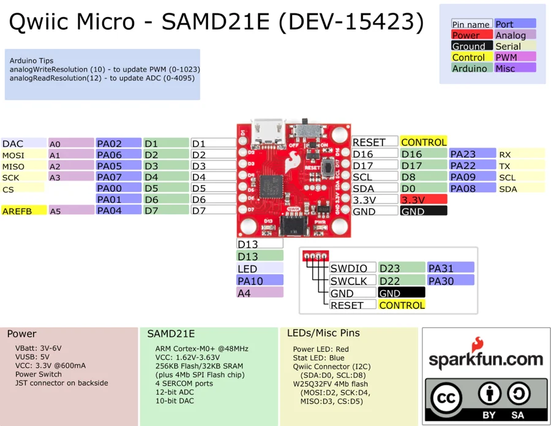

# Qwiic Micro SAMD21

**SparkFun** · SAMD21E

Revision: Not identified

Coverage: Physical pinout source collected; scope and revision require confirmation

[Browse all manufacturers](../../../../BROWSE.md) · [Devices & IoT](../../../../DEVICES.md) · [Open in the browser guide](https://valleytech-black-wire-guide.pages.dev/?board=sparkfun-qwiic-micro-samd21)

Architecture: **ARM**

## Specifications and hardware documentation

- [Specifications & hardware guide](https://www.sparkfun.com/products/15423)

## Original manufacturer graphical reference (PDF)

**original reference PDF** · Reviewed source · PDF

[Open original reference](../../../../library/media/3484ff69a779f2899522b7654d26732b8d0a2739c9dd5446a8d334a96e55816f.pdf)

**Credit and rights:** SparkFun Electronics / graphical datasheet contributors. CC BY-SA marking retained in the original; verify the applicable version in the source repository before redistribution.. Source/manufacturer: SparkFun.

[Source 1](https://raw.githubusercontent.com/sparkfun/Graphical_Datasheets/736369896be44fae46b1e04bd370dd88ef73a227/Datasheets/SAM21/Qwiic_Micro_Graphical_Datasheet_V1a.pdf) · [Source 2](https://www.sparkfun.com/products/15423) · [Source 3](https://github.com/sparkfun/Graphical_Datasheets/tree/736369896be44fae46b1e04bd370dd88ef73a227)

Original publisher reference. Exact board/revision and electrical limits still require confirmation.

Image revision: Not identified

SHA-256: `3484ff69a779f2899522b7654d26732b8d0a2739c9dd5446a8d334a96e55816f`

## Manufacturer board pinout — page 1

**pinout image** · Reviewed source · PNG

[Open original reference](../../../../library/media/ce58339cee09909d1bf6496dfdc76ef20f41a77f85d9b3d00df41a2b3e6d91c0.png)

**Credit and rights:** SparkFun Electronics / graphical datasheet contributors. CC BY-SA marking retained in the original; verify the applicable version in the source repository before redistribution.. Source/manufacturer: SparkFun.

[Source 1](https://raw.githubusercontent.com/sparkfun/Graphical_Datasheets/736369896be44fae46b1e04bd370dd88ef73a227/Datasheets/SAM21/Qwiic_Micro_Graphical_Datasheet_V1a.pdf) · [Source 2](https://www.sparkfun.com/products/15423) · [Source 3](https://github.com/sparkfun/Graphical_Datasheets/tree/736369896be44fae46b1e04bd370dd88ef73a227)

Original publisher reference. Exact board/revision and electrical limits still require confirmation.  PDF page rendered at 144 dpi without changing labels. Original vector PDF retained.

Image revision: Not identified

SHA-256: `ce58339cee09909d1bf6496dfdc76ef20f41a77f85d9b3d00df41a2b3e6d91c0`

Pin assignments have not been independently electrically verified. Check board revision before wiring.
