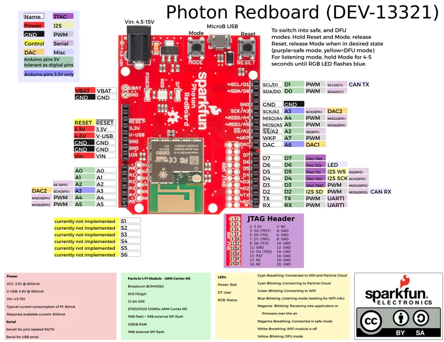

# Photon RedBoard

**SparkFun** · STM32F205

Revision: Not identified

Coverage: Physical pinout source collected; scope and revision require confirmation

[Browse all manufacturers](../../../../BROWSE.md) · [Devices & IoT](../../../../DEVICES.md) · [Open in the browser guide](https://valleytech-black-wire-guide.pages.dev/?board=sparkfun-photon-redboard)

Architecture: **ARM**

## Specifications and hardware documentation

- [Archived manufacturer hardware reference](https://github.com/sparkfun/Graphical_Datasheets/tree/736369896be44fae46b1e04bd370dd88ef73a227/Datasheets/PhotonRedboard)

## Original manufacturer graphical reference (PDF)

**original reference PDF** · Reviewed source · PDF

[Open original reference](../../../../library/media/97ba71514776bce6449bb7776e13bc928b65dd93e28db03a4dee6ef452e2fd13.pdf)

**Credit and rights:** SparkFun Electronics / graphical datasheet contributors. CC BY-SA marking retained in the original; verify the applicable version in the source repository before redistribution.. Source/manufacturer: SparkFun.

[Source 1](https://raw.githubusercontent.com/sparkfun/Graphical_Datasheets/736369896be44fae46b1e04bd370dd88ef73a227/Datasheets/PhotonRedboard/PhotonRedboardV1.pdf) · [Source 2](https://www.sparkfun.com/products/13321) · [Source 3](https://github.com/sparkfun/Graphical_Datasheets/tree/736369896be44fae46b1e04bd370dd88ef73a227)

Original publisher reference. Exact board/revision and electrical limits still require confirmation.

Image revision: Not identified

SHA-256: `97ba71514776bce6449bb7776e13bc928b65dd93e28db03a4dee6ef452e2fd13`

## Manufacturer board pinout — page 1

**pinout image** · Reviewed source · PNG

[Open original reference](../../../../library/media/223563f326d839622148b18320d322e85178e844582936bf61bb6bf7a2b4b271.png)

**Credit and rights:** SparkFun Electronics / graphical datasheet contributors. CC BY-SA marking retained in the original; verify the applicable version in the source repository before redistribution.. Source/manufacturer: SparkFun.

[Source 1](https://raw.githubusercontent.com/sparkfun/Graphical_Datasheets/736369896be44fae46b1e04bd370dd88ef73a227/Datasheets/PhotonRedboard/PhotonRedboardV1.pdf) · [Source 2](https://www.sparkfun.com/products/13321) · [Source 3](https://github.com/sparkfun/Graphical_Datasheets/tree/736369896be44fae46b1e04bd370dd88ef73a227)

Original publisher reference. Exact board/revision and electrical limits still require confirmation.  PDF page rendered at 144 dpi without changing labels. Original vector PDF retained.

Image revision: Not identified

SHA-256: `223563f326d839622148b18320d322e85178e844582936bf61bb6bf7a2b4b271`

Pin assignments have not been independently electrically verified. Check board revision before wiring.
